# Torrevie SaaS Platform — High-Level Design

## 1. Document Control

| Field | Value |
| --- | --- |
| Title | Torrevie SaaS Platform High-Level Design |
| Version | 1.0 |
| Status | Draft, for architecture review |
| Date | 11 July 2026 |
| Author role | Principal Solution Architect (Cloud, Security, DevOps, Platform Strategy) |
| Reviewers required | Founder / Operations lead, Business Development Director, lead engineer assigned to Codex-driven build |
| Intended audience | Torrevie leadership, engineering, security reviewer, future hires, OpenAI Codex as an implementation agent |

This document is written to be loaded into project knowledge and referenced directly by Codex. Every recommendation states a decision. Where a decision needs validation through a proof of concept, that is called out explicitly rather than left implicit.

---

## 2. Executive Summary

Torrevie is moving from five independent product builds, CRM, FSM, TEX, CME, and LQS, into one SaaS platform that a growing set of customer organizations can subscribe to. The core design problem is not any single product. It is the shared foundation underneath all five: tenants, users, roles, subscriptions, entitlements, audit, storage, and identity.

The recommendation in this document is a **modular monolith**, built as a single Next.js and TypeScript monorepo, deployed on Vercel, backed by a **single shared Supabase PostgreSQL database** using **row-level security and a mandatory tenant_id** on every tenant-scoped table. Flutter is scoped to **mobile only**, starting with the FSM technician application, where offline support and device sensors justify a native mobile framework. No microservices are introduced at launch. The architecture is deliberately built so that a domain can be extracted into its own service later without a rewrite, but nothing is split out until there is a measured reason to.

The first production vertical slice is CRM, since it already has the most mature existing implementation at crm1.torrevie.com and the simplest data model to validate the platform foundation against. Before that slice ships, four things must exist and be tested: tenant provisioning, authentication, row-level security, and audit logging. Everything else, including AI, workflow, and integrations, is added in later phases once that foundation is proven.

---

## 3. Business Objectives

- Operate one platform, not five disconnected products, so that adding a sixth product is a configuration exercise, not a rebuild.
- Onboard customer organizations centrally, with Torrevie staff provisioning tenants, assigning product subscriptions, and managing entitlements from one control plane.
- Give every customer strict data isolation, with no realistic path for one tenant to read or write another tenant's records.
- Let a single user identity carry across every subscribed module, rather than forcing a separate login per product.
- Support Arabic and English, including right-to-left layout, from the outset, since the primary market is the UAE and wider GCC.
- Keep the platform buildable and reviewable by a small team assisted by Codex, which means clear module boundaries and a repository structure Codex can work inside safely.

---

## 4. Scope

### In scope

- Platform foundation: tenancy, identity, roles, entitlements, subscriptions, audit, storage, notifications.
- Torrevie Control Plane (internal administration).
- Customer and product administration layers.
- Conceptual and logical data architecture for the platform and for CRM, FSM, TEX, CME, and LQS.
- Authentication and authorization design, including Supabase Auth usage and row-level security.
- Frontend architecture for web (Next.js) and mobile (Flutter).
- AI gateway design for CME and LQS.
- Integration, workflow, notification, background-job, reporting, and observability architecture.
- Deployment topology, repository strategy, and a Codex-ready engineering model.
- Security, compliance posture, backup and disaster recovery, and a risk register.

### Out of scope

- Detailed low-level database schema (column-by-column) for each product. This document defines entities and ownership; the LLD defines columns, types, and constraints.
- Final UI design and component specification. The Visual Identity and Brand Guidelines documents govern look and feel; this document governs system architecture.
- Formal legal or regulatory certification. Compliance posture is described; certification requires legal review, stated explicitly wherever it applies.
- Final commercial pricing and billing-provider selection. Usage metering is designed; the billing integration itself is deferred.

---

## 5. Assumptions

- Torrevie will operate as the vendor of record for all five products, on infrastructure it controls, rather than reselling third-party software.
- The primary customer base for the first 12 to 18 months is UAE and Saudi Arabia based, operating in English and Arabic.
- Existing crm1, fsm1, and tex1 environments are early-stage builds, not production systems carrying live customer data, and can be assessed for reuse rather than treated as a live migration with zero downtime constraints. This assumption must be confirmed before Phase 10 planning.
- Supabase and Vercel remain the preferred vendors for the first 18 months, evaluated against the specific requirements in this document rather than accepted by default.
- The team building this platform is small, likely one to three engineers plus Codex as an implementation agent, for the first two phases.
- No enterprise customer in year one requires a dedicated, physically isolated database. This is treated as a future path, not a launch requirement.

---

## 6. Constraints

- Budget favors managed services over self-hosted infrastructure wherever the cost difference is reasonable, since Torrevie does not plan to run its own platform operations team in year one.
- The platform must support Arabic and English and right-to-left layout from the first customer-facing release, not as a later retrofit.
- Development must be scoped into units small enough for Codex to execute and for a human reviewer to review in a single sitting. This shapes the repository and work-package structure directly.
- Torrevie's brand system, name usage, and slogan usage, as defined in the Brand Guidelines document, apply to every customer-facing surface this platform produces, including the admin portal, the customer portal, and system emails.

---

## 7. Non-Functional Requirements

These are preliminary targets. Items marked "requires business approval" must be confirmed with Torrevie leadership before being treated as commitments to customers.

| Category | Preliminary target | Status |
| --- | --- | --- |
| Availability | 99.5 percent for customer-facing applications in year one | Requires business approval before stated in any SLA |
| Performance | Under 300ms median API response for in-region requests, under 2.5s largest contentful paint on the customer portal | Engineering target, not a contractual commitment |
| Security | No cross-tenant data access under any tested scenario; this is release-blocking, not a target | Locked |
| Scalability | Support 100 tenants and 2,000 total users without architecture change | Assumption, to be load tested before general availability |
| Accessibility | WCAG 2.1 AA on customer-facing web applications | Target for Phase 4 onward |
| Localization | Full Arabic and English parity, right-to-left rendering verified on every screen | Locked requirement |
| Recovery | Recovery point objective of 24 hours, recovery time objective of 4 hours for a full platform outage in year one | Requires business approval |
| Audit retention | Minimum 12 months of audit-event retention, extendable per customer contract | Requires business approval for exact figure |

---

## 8. Current-State Summary

Three products have early implementations on separate subdomains: crm1.torrevie.com, fsm1.torrevie.com, and tex1.torrevie.com. CME and LQS exist as product concepts without confirmed implementations. Each existing environment was built independently, with its own likely authentication, its own likely data model, and no shared tenancy concept. There is no confirmed central identity, no confirmed multi-tenant boundary, and no confirmed shared administration layer across the three live subdomains.

This fragmentation is the reason this document exists. The recommendation in Section 37, Migration of Existing Applications, is to treat crm1 as a strong candidate for a controlled rebuild onto the shared platform rather than a lift-and-shift, since a shared tenancy and identity model cannot be retrofitted onto three independently built codebases without effectively rebuilding their data layers regardless.

---

## 9. Recommended Architecture

**Recommendation: a modular monolith, one Next.js and TypeScript codebase in a monorepo, one shared Supabase PostgreSQL database with row-level security, deployed on Vercel, with Flutter reserved for mobile applications only.**

This is the architecture for MVP through medium-scale growth. It is not the permanent architecture for every stage of Torrevie's life. Section 28 defines the stages at which specific parts of this design, background processing first, then reporting, then possibly individual product domains, become candidates for extraction into separate services.

The reasoning, in short: five products sharing tenants, users, roles, and entitlements need a single source of truth for those concepts. A modular monolith gives every product access to that shared foundation through internal package boundaries, enforced by code review and folder structure, without the operational cost of running and securing five to ten separate services from day one. Microservices solve a problem Torrevie does not yet have, independent scaling and independent team ownership of each product, and introduce a problem Torrevie does have right now, a small team needing to move quickly without cross-service authentication and data-consistency overhead.

---

## 10. Architecture Alternatives Considered

| Alternative | Why it was set aside for MVP |
| --- | --- |
| Full microservices, one service per product | Correct multi-tenant authorization becomes a distributed problem five times over before the platform has a single paying customer. Operational overhead is disproportionate to team size. |
| Separate Supabase project per product | Duplicates authentication, duplicates the tenant and subscription model, and defeats the purpose of a unified customer identity across products. |
| Flutter Web for the customer portal and admin portal | Complex data grids, SEO for marketing pages, and desktop-first data entry workflows are better served by a mature web framework. Flutter is kept for what it is strongest at, native mobile with offline support. |
| A fully configurable, no-code workflow engine at launch | High build cost for a capability only TEX approvals and CRM stage transitions need at launch. A lightweight, shared workflow library is recommended instead, described in Section 21. |
| Polyrepo, one repository per application | Increases the coordination cost of shared packages (auth, tenant context, UI) across five to ten repositories, and is harder for Codex to reason about as one coherent system. |

---

## 11. System Context

Torrevie operates one platform serving two audiences: Torrevie staff, who provision and manage customer tenants through the Control Plane, and customer users, who work inside one or more subscribed product modules through a single identity.

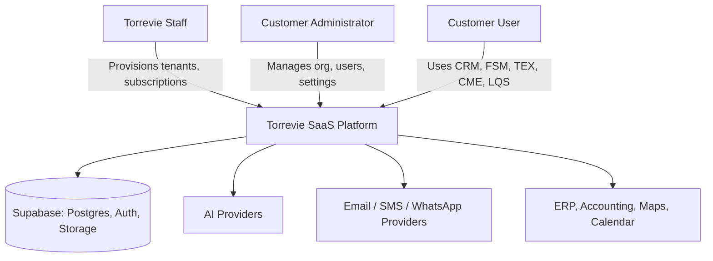

---

## 12. Application and Service Architecture

The platform is one Next.js application deployed on Vercel, organized internally by route group per surface, backed by shared internal packages. It is a single deployable unit at launch, not five deployable units, which keeps release coordination simple while the team is small.

| Surface | Route group | Audience |
| --- | --- | --- |
| Torrevie Control Plane | `/admin/*` on `admin.torrevie.com` | Torrevie staff only |
| Customer Portal shell | `/` on `app.torrevie.com` | All authenticated customer users |
| CRM | `/crm/*` | Customer users with CRM entitlement |
| FSM web | `/fsm/*` | Customer users with FSM entitlement, office-side roles |
| TEX | `/tex/*` | Customer users with TEX entitlement |
| CME | `/cme/*` | Customer users with CME entitlement |
| LQS | `/lqs/*` | Customer users with LQS entitlement |

FSM's technician-facing mobile experience is a separate Flutter application, described in Section 18, since field technicians need offline capability and device sensors that a web app cannot reliably provide.

Splitting `admin.torrevie.com` and `app.torrevie.com` as two Vercel deployments of the same monorepo, rather than two route groups of one deployment, is the recommended default. This keeps Torrevie's internal administration surface off the customer-facing domain entirely, which is a meaningful security boundary at effectively no extra operational cost, since Vercel supports multiple projects from one monorepo without duplicating code.

---

## 13. Platform Versus Product Boundaries

Shared platform domains, owned centrally and consumed by every product:

Identity, tenant management, user management, roles and permissions, product catalogue, subscriptions, entitlements, feature flags, usage metering, notifications, files and attachments, audit logging, integration and API credential management, localization, customer branding, and system configuration.

Product-owned domains:

| Product | Owns |
| --- | --- |
| CRM | Accounts, contacts, leads, opportunities, pipelines, quotations, sales activities |
| FSM | Assets, service contracts, service requests, work orders, technician scheduling, checklists, parts and materials |
| TEX | Travel requests, expense claims, policies, per diem and mileage rules, reimbursements |
| CME | Campaigns, content calendars, content briefs, asset libraries, publishing workflows |
| LQS | Lead capture, scoring rules, qualification stages, routing rules |

Shared concepts that appear in more than one product, organizations, contacts, tasks, documents, approvals, and notifications, are owned once by the platform and referenced by each product rather than duplicated. A CRM contact and an FSM site contact both point at the same platform `contacts` table, distinguished by a `context` or `source_module` field rather than by separate tables. This avoids the failure mode of five products each inventing their own version of "a person," which would make CME's audience targeting or LQS's lead-to-contact handoff far harder later. Product-specific business logic, an opportunity's pipeline stage, a work order's status, stays inside the owning product's schema boundary and is never referenced directly by another product's tables. Cross-product access happens through the shared platform tables or through an explicit internal API, never through a foreign key that reaches into another product's private schema.

---

## 14. Multi-Tenancy Architecture

**Recommendation: Model 1, a shared PostgreSQL database, shared schema, mandatory `tenant_id` on every tenant-scoped table, enforced by strict row-level security. Model 4, hybrid tenancy with a dedicated Supabase project for a specific enterprise customer, is retained as a future path, not a launch requirement.**

### Assessment of the four models

| Model | Isolation | Operational overhead | RLS complexity | Fit for Torrevie now |
| --- | --- | --- | --- | --- |
| 1: Shared database, shared schema, tenant_id | Logical, enforced by RLS and application checks | Lowest, one database to provision, back up, and monitor | Moderate, every table needs a policy, but the pattern repeats | Yes, the recommended default |
| 2: Shared database, schema per tenant | Stronger logical isolation | High, schema count grows with tenant count, migrations must run per schema | Lower per table, higher at the migration-tooling level | No, migration tooling and connection pooling do not scale cleanly past a small number of schemas |
| 3: Separate database or Supabase project per tenant | Strongest isolation | Very high, one project to provision, secure, monitor, and bill per tenant | Simplest RLS, since there is only one tenant per database | No for launch, reserved for specific enterprise contracts later |
| 4: Hybrid, shared for most, dedicated for select enterprise tenants | Configurable per customer | Moderate, most tenants stay simple, a small number get dedicated handling | Same as Model 1 for shared tenants | Yes, as the long-term target once an enterprise contract requires it |

Model 1 is validated as correct for Torrevie's current stage because customer counts are expected to be small to moderate in year one, workloads are not expected to be so large that noisy-neighbor risk is a near-term concern, and the operational simplicity of one database materially reduces what a two-to-three person team must secure and monitor. Its limitation is real: a single-tenant point-in-time restore from a shared database is not a native Supabase capability and must be engineered deliberately, addressed in Section 27.

### Establishing and propagating tenant context

- Every authenticated session carries a `tenant_id` claim, set at login time from the user's active tenant membership, and re-validated on every request rather than trusted indefinitely.
- Every Supabase query from server-side code runs through a request-scoped Postgres client that sets `app.current_tenant_id` for the session, which RLS policies read directly. Client-side Supabase calls are restricted to the anonymous key with RLS as the only line of defense, never the service role key.
- Every tenant-scoped table carries a non-nullable `tenant_id uuid` column, a foreign key to `tenants.id`, and an RLS policy of the form `USING (tenant_id = current_tenant_id())` for select, insert, update, and delete, defined as four explicit policies rather than one combined policy, so each operation is testable independently.
- Storage objects are namespaced by tenant in the object path, `tenant/{tenant_id}/{product}/...`, and Storage RLS policies check the same tenant claim against the path prefix.
- Edge Functions, background jobs, and webhook handlers receive an explicit `tenant_id` parameter rather than inferring it from ambient session state, since these run outside a user session.
- Realtime subscriptions are scoped per tenant using RLS on the underlying table, so a client cannot subscribe to another tenant's change stream even if it guesses a channel name.
- Reporting and administrative operations that intentionally cross tenants run under a distinct, explicitly audited service role, never under a customer session, and every such query is logged with the operator's identity and the tables touched.

### What this prevents, and how

| Threat | Control |
| --- | --- |
| Cross-tenant reads or writes | RLS on every tenant table, tested per table in the tenant-isolation test suite (Section 26) |
| Cross-tenant file access | Storage RLS keyed to the tenant-prefixed object path |
| Cross-tenant realtime events | RLS applied to the underlying replication stream, not just the initial query |
| Insecure direct object references | Every lookup by ID is scoped by tenant_id in the same query, never a bare primary-key lookup |
| Service-role-key misuse | Service role key is never shipped to a browser or Flutter client; it exists only in Vercel server environment variables and Edge Function secrets |
| Tenant spoofing | Tenant claim is derived server-side from the authenticated session's membership record, never accepted as a client-supplied parameter |
| Privilege escalation | Role and permission checks are enforced server-side and by RLS, never by hiding a button in the UI alone |

---

## 15. Data Architecture

This section defines entities and ownership, not full column-level schema. Column-level detail belongs in the Database LLD.

### Platform entities

| Entity | Owning domain | Tenant scope | Notes |
| --- | --- | --- | --- |
| tenants | Tenant management | Global | One row per customer organization |
| tenant_settings | Tenant management | Per tenant | Branding, locale defaults, feature toggles |
| tenant_domains | Tenant management | Per tenant | Custom domain records, if used later |
| products | Product catalogue | Global | CRM, FSM, TEX, CME, LQS, and future modules |
| plans | Subscription management | Global | Named commercial plans per product |
| plan_features | Subscription management | Global | Feature entitlements included in a plan |
| subscriptions | Subscription management | Per tenant | Which products a tenant has, start and expiry |
| subscription_entitlements | Subscription management | Per tenant | Resolved limits, user counts, storage, feature flags |
| users | Identity | Global identity, tenant-scoped membership | One user account can belong to more than one tenant |
| user_profiles | Identity | Per tenant | Display name, locale, avatar, role-specific profile fields |
| tenant_memberships | Identity | Per tenant | Links a user to a tenant with a status |
| roles | Roles and permissions | Global template, tenant-overridable | Platform-defined roles plus custom roles |
| permissions | Roles and permissions | Global | Fine-grained action definitions |
| role_permissions | Roles and permissions | Per role | Mapping table |
| user_role_assignments | Roles and permissions | Per tenant | Which roles a user holds in a tenant |
| feature_flags | Feature flags | Global and per tenant | Platform-wide and tenant-specific overrides |
| usage_events | Usage metering | Per tenant | Raw event stream, API calls, AI calls, storage writes |
| usage_aggregates | Usage metering | Per tenant | Rolled-up counts per billing period |
| audit_events | Audit | Per tenant, with a Torrevie-wide view for staff | Every significant state change, with actor, action, target, timestamp |
| integration_connections | Integration | Per tenant | Configured third-party connections |
| integration_secrets | Integration | Per tenant | Encrypted credentials, never logged |
| webhook_endpoints | Integration | Per tenant | Outbound webhook subscriptions |
| webhook_deliveries | Integration | Per tenant | Delivery attempts, status, retry history |
| notifications | Notification | Per tenant | In-app, email, push, SMS records |
| files | Storage | Per tenant | Metadata pointer to a Storage object |
| support_access_sessions | Security | Per tenant, visible to Torrevie staff | Records of controlled staff impersonation |
| provisioning_jobs | Tenant management | Per tenant | Onboarding task tracking |
| provisioning_steps | Tenant management | Per tenant | Individual steps within a provisioning job |

### Product entity summary

CRM: accounts, contacts, leads, opportunities, pipeline_stages, activities, quotations, quotation_line_items.

FSM: customer_sites, assets, service_contracts, service_requests, work_orders, technician_assignments, checklists, checklist_responses, parts, work_order_parts.

TEX: travel_requests, expense_claims, expense_line_items, expense_policies, approval_steps, reimbursements.

CME: campaigns, content_briefs, content_assets, content_calendar_items, publishing_targets, ai_generation_requests.

LQS: leads (references the platform contact where a person already exists), qualification_questionnaires, qualification_responses, scoring_rules, routing_rules.

### Standards applied to every table

- UUID primary keys everywhere, generated server-side, never client-supplied.
- `created_at`, `updated_at` timestamps with time zone on every table, set by trigger, not by application code.
- `created_by`, `updated_by` referencing `users.id`, nullable only for system-generated rows.
- `tenant_id` on every tenant-scoped table, indexed, and included as the leading column in composite indexes used for tenant-scoped queries.
- Optimistic concurrency via an integer `version` column on tables subject to concurrent edits, such as work orders and opportunities.
- Soft deletion via a `deleted_at` timestamp on tables where recovery or audit history matters, such as contacts and files; hard deletion only for genuinely transient data, such as expired sessions.
- Status fields as Postgres enums where the value set is small and stable, such as `work_order_status`; a reference table where customers may need to configure their own values, such as CRM pipeline stages.
- JSONB reserved for genuinely variable, customer-configured structures, such as questionnaire responses in LQS or checklist responses in FSM, never used as a substitute for a normalized column when the shape is fixed and known.
- Full-text search via Postgres `tsvector` columns and generated indexes for CRM and FSM search, sufficient at current scale; a dedicated search service is not justified for MVP.
- Vector storage via `pgvector` is deferred until CME or LQS has a concrete retrieval-augmented generation use case; it is not adopted speculatively.
- Every schema change ships as a numbered, forward-only Supabase migration file, checked into the repository, never edited after merge; corrections ship as a new migration.
- Seed data is environment-specific, held under `supabase/seed/`, and never includes real customer data.

---

## 16. Authentication and Authorization

### Authentication

Supabase Auth is the recommended provider for launch. It covers email and password, passwordless magic links, email verification, password reset, and multi-factor authentication out of the box, which removes the need to build or operate a separate identity service.

- Login methods: email and password, and email magic link. MFA is available at signup for administrator roles and offered to every user, required for Torrevie staff accounts without exception.
- Session and refresh-token handling uses Supabase's default rotating refresh tokens, with access-token lifetime kept short, in the range of 15 to 60 minutes, and refresh handled transparently by the client library.
- Account lockout applies after repeated failed attempts, with a backoff window, enforced by Supabase Auth rate limiting plus an application-level check for suspicious patterns.
- Every login, failed login, password reset, and MFA event is written to `audit_events`.
- Invitations are the only way a new customer user is created; open self-registration is not offered for customer tenants.
- Deactivated users retain their historical audit trail but lose the ability to authenticate, enforced by a status check at the authentication boundary, not by deleting the account.
- Service accounts, used by integrations, authenticate with a scoped API key tied to a specific tenant and a specific set of permissions, never with a user's credentials.
- SSO, SAML, Microsoft Entra ID, and Google Workspace are not built at launch. Supabase Auth supports enterprise SSO providers, so this is a configuration addition for a specific enterprise contract later, not an architecture change.

### Authorization

Authorization is layered, and no single layer is trusted alone.

1. Tenant membership: a user must hold an active membership in a tenant before any tenant-scoped request is even evaluated.
2. Role-based access control: each membership carries one or more roles, each role carries a fixed set of permissions.
3. Product entitlements: an action is only permitted if the tenant's subscription includes the relevant product and the specific feature is within plan limits.
4. Resource ownership and business rules: for example, a sales rep can edit their own opportunities, a sales manager can edit any opportunity on their team, enforced in server-side logic, not just by role.
5. Row-level security: the database itself refuses any query that does not match the caller's tenant and, where applicable, ownership context, as a final backstop even if an application-layer check is ever missed.

Hiding a button in the interface is a usability choice, not a security control. Every authorization decision that matters is enforced on the server, in the API layer and in the database, because a browser or a mobile client is not a trusted environment, and any client-side check can be bypassed by calling the API directly.

### JWT claims and staleness

The JWT issued by Supabase Auth carries the user's identity and a small set of stable claims, active `tenant_id` and a coarse role name. It deliberately does not carry the full, fine-grained permission set, since permissions can change between token refreshes.

- Role changes, subscription changes, tenant suspension, and permission updates are enforced by checking current state in the database on every request that matters, not by trusting a cached claim.
- For high-value actions, provisioning, billing-affecting changes, deactivating a user, the server re-reads the caller's current role and entitlement state immediately before executing, rather than relying on any cached value at all.
- Token refresh interval is kept short enough, combined with server-side re-checks on sensitive actions, that a revoked user's access window after revocation is measured in minutes, not hours.

### Example authorization flows

1. **CRM user reading an opportunity.** Session carries tenant_id and user_id. API checks the user holds an active CRM-entitled membership in that tenant, then checks role permissions for `opportunity.read`, then checks ownership rules, own record, team record, or org-wide, based on role. RLS independently enforces tenant_id match at the database layer.
2. **FSM technician updating an assigned work order.** Mobile app authenticates the technician, request includes the work order ID. Server checks the technician is assigned to that specific work order, not just that they hold the technician role generally, then applies the update, then writes an audit event and a status-change notification.
3. **Finance approver approving a travel expense.** Server checks the approver is the current step's designated approver in the expense's approval chain, not simply a user with a "finance" role, since approval routing is contextual, not a static permission.
4. **Torrevie administrator provisioning a product.** Requires a Torrevie staff role with the `platform.provision` permission, distinct from any customer-facing role; the action is logged with the operator's identity and reviewable by a Torrevie security administrator.
5. **Support agent accessing customer data under approved support access.** Requires an explicit, time-boxed `support_access_session` created with the customer's or an authorized internal approver's consent, every action taken during that session is tagged and fully audited, and the session expires automatically.
6. **Integration service posting leads into LQS.** Authenticates with a tenant-scoped API key carrying only the `lead.create` permission, rate limited, and every posted lead is attributed to the integration's service account in the audit trail rather than to a human user.

---

## 17. Supabase Architecture

| Capability | Use case | Pattern | Key limitation |
| --- | --- | --- | --- |
| PostgreSQL | System of record for all platform and product data | One shared database, RLS on every tenant table | Single-tenant restore requires deliberate tooling, see Section 27 |
| Auth | User authentication, session management, MFA | Supabase-managed, custom claims for tenant_id | Fine-grained permissions kept out of the JWT, checked server-side |
| Storage | Files, attachments, receipts, checklist photos | Tenant-prefixed object paths, Storage RLS | Large file volume long term may need lifecycle rules to control storage cost |
| Realtime | Live work-order status, live notification badges | Subscriptions scoped by RLS on the source table | Not used for high-frequency streaming; kept to UI-relevant state changes |
| Edge Functions | Webhook receivers, AI gateway calls, scheduled aggregation | TypeScript functions, short-lived, stateless | Not suited to long-running jobs; those are deferred to an external worker, Section 19 |
| Cron / scheduled functions | Usage aggregation, subscription expiry checks, digest notifications | Supabase scheduled triggers calling Edge Functions | Coarse scheduling only; complex workflow scheduling waits for a dedicated system if needed |
| Database webhooks | Triggering async work on row changes, such as a new lead | Postgres trigger to Edge Function | Must be idempotent, since delivery is at-least-once |
| Vault / secrets | Storing integration credentials, API keys | Supabase Vault for at-rest encryption of secrets | Application code still must never log decrypted values |
| Connection pooling | Serverless function concurrency | Supabase's pooled connection string (PgBouncer) for all serverless paths | Long-running admin scripts use the direct connection instead |
| Backups | Point-in-time recovery | Supabase managed backups, verified restore drills quarterly | Tenant-level restore is a custom procedure, not a native feature |
| Branching / previews | Safe review of schema changes | Supabase preview branches per pull request where available on the plan in use | Must never point at production data |
| Migrations | Schema evolution | Supabase CLI, SQL migration files, applied in CI, never by hand against production | Every migration reviewed like application code |
| Local development | Fast iteration | Supabase CLI local stack, seeded with synthetic tenants | Must mirror production RLS policies exactly |
| Logs / observability | Query performance, auth failures, function errors | Supabase logs exported to the platform's observability pipeline, Section 20 | Retention on the Supabase side alone is not sufficient for the audit retention target |
| pgvector | Semantic search, AI retrieval | Deferred until a concrete CME or LQS use case is scoped | Not adopted speculatively |

Service-role credentials exist only in Vercel's server-side environment variables and in Edge Function secrets. They are never present in browser bundles, Flutter builds, public repositories, or application logs. Any code path that needs to bypass RLS for a legitimate platform reason, cross-tenant reporting for Torrevie staff, provisioning, runs through a small, explicitly reviewed set of server-only functions, never through ad hoc service-role usage scattered across the codebase.

Storage buckets are organized as `tenant/{tenant_id}/{product}/{entity_type}/{entity_id}/{file_id}`, with one bucket per broad category, such as `attachments` and `avatars`, rather than one bucket per tenant, since bucket-per-tenant does not scale operationally. Storage RLS policies parse the `tenant_id` segment of the path and compare it against the caller's tenant claim, applied identically to reads, writes, and deletes.

---

## 18. Web and Mobile Architecture

### Web

**Recommendation: Next.js with TypeScript, deployed on Vercel, for every web surface, the Control Plane, the Customer Portal, and all five product modules.**

Next.js is chosen over Flutter Web for the web surfaces because the customer portal and admin portal need complex data grids, print-friendly document output, strong SEO on any public marketing pages, fast initial load, and mature accessibility support, all of which are Flutter Web's known weak points relative to a native web framework. Server components are used for data-heavy list and detail views, client components for interactive forms and dashboards. Supabase's server and browser client libraries are used at the appropriate boundary, server components and API routes use the server client with the pooled connection, browser components use the anonymous key client governed by RLS.

- Schema validation on every form and API boundary using a single shared validation library, so the same rules apply on the client for immediate feedback and on the server as the actual enforcement point.
- Internationalization is built in from the first release, with Arabic and English message catalogues and a layout system that flips correctly under right-to-left, tested on every shared component before any product-specific screen is built on top of it.
- Accessibility and responsive design are treated as a Definition of Done item for every screen, not a later pass.

### Mobile

**Recommendation: Flutter and Dart, for native mobile only, starting with the FSM technician application.**

Flutter Web is explicitly not recommended for any Torrevie web application. It is evaluated and rejected because desktop usability, SEO, complex data grids, and printing all favor Next.js, and code reuse alone is not a strong enough reason to accept those trade-offs.

Recommended Flutter architecture:

- Presentation layer: screens and widgets, using a View and ViewModel pattern, ViewModels hold UI state and call into the domain layer, never call Supabase directly.
- Domain layer: use cases specific to FSM field workflows, such as "start a job," "submit a checklist," "capture a signature," each a small, independently testable unit.
- Data layer: repositories that abstract the data source, backed by an API client for online operations and a local cache for offline operations, so the domain layer never knows whether data came from the network or the local store.
- DTOs at the data-layer boundary, mapped to domain models before reaching the presentation layer, so a backend API change does not ripple directly into UI code.
- State management: a single, consistent approach across the app, chosen and documented in the Flutter Application LLD rather than mixed per screen.
- Navigation: a declarative router with typed routes, so deep links, such as opening a specific work order from a push notification, are reliable.
- Dependency injection: constructor-based, resolved through a single composition root, avoiding a global service locator scattered through the codebase.
- Offline-ready architecture: a local database, actions queued when offline and synchronized when connectivity returns, with conflict handling defined explicitly for work-order status and checklist submissions, since a technician may complete work in an area with no signal.
- Secure local storage for cached credentials and tokens, using the platform keychain or equivalent, never plain shared preferences for anything sensitive.
- Push notifications for job assignment and schedule changes, camera and file upload for job photos and signatures, and location services used only for authorized FSM check-in and check-out, never running in the background beyond what the technician has explicitly consented to.

Specific Flutter package choices are deferred to the Flutter Application LLD, where exact versions are verified against the current Flutter stable channel at implementation time rather than pinned speculatively in this document.

---

## 19. Torrevie Control Plane

The Control Plane is a Torrevie-staff-only surface at `admin.torrevie.com`, entirely separate in deployment from the customer-facing portal, though it shares the same underlying packages for auth, tenant context, and UI components.

### Customer lifecycle

Create, edit, suspend, reactivate, and archive a tenant. Record legal and billing details, select the tenant's region, define environments where relevant, and track onboarding progress with implementation notes visible to the Torrevie team handling that account.

### Product subscription management

Assign one or more products to a tenant, activate or disable individual modules, configure the commercial plan, set start and expiry dates including trial periods, define user, storage, and usage limits, toggle premium features per tenant through feature flags, and record the underlying commercial agreement and support plan.

### Tenant provisioning

Provisioning is modeled as a `provisioning_job` with a sequence of `provisioning_steps`, each independently retryable. A new tenant's provisioning job runs: generate tenant identifier, create the tenant record, initialize default tenant settings, create the first customer administrator invitation, apply default roles and permissions, initialize product-specific default records, such as a default CRM pipeline, set up the tenant's storage path convention, and send the onboarding email. Every step writes its status to `provisioning_steps`, so a failure at step four does not silently abandon the tenant in a half-created state; the Control Plane surfaces exactly which step failed and allows a retry of that step alone.

### Customer management

Torrevie staff can view a tenant's users, active modules, subscription status, usage against limits, API and AI usage, storage usage, audit activity, and any system health signals relevant to that tenant. Staff can disable a compromised user immediately. Impersonation of a customer administrator is available only through the controlled support-access mechanism described in Section 16, never as an unrestricted "log in as" feature.

### Platform operations

Global feature flags, the module and plan catalogue, entitlement definitions, usage-metering dashboards, platform-wide announcements and maintenance notices, tenant health, failed background jobs, integration failures, security events, audit-log review, and release visibility all live in the Control Plane, giving Torrevie one place to see the health of the entire platform rather than piecing it together from separate tools.

### Role hierarchy

| Role | Scope |
| --- | --- |
| Torrevie platform administrator | Full Control Plane access, including provisioning and subscription management |
| Torrevie operations administrator | Tenant health, provisioning, and support access, without billing or security configuration |
| Torrevie support agent | Read access to tenant health and time-boxed, audited support-access sessions only |
| Torrevie billing administrator | Subscription, plan, and usage data only |
| Torrevie security administrator | Audit logs, security events, and access-control configuration only |
| Customer administrator | Full administration of their own tenant only |
| Customer module administrator | Administration scoped to one subscribed product within their tenant |
| Customer manager | Elevated permissions within a product, such as approving expenses or reassigning leads |
| Customer standard user | Day-to-day product usage within their permitted scope |
| Customer read-only user | View-only access, useful for stakeholders who need visibility without edit rights |
| Integration service account | Scoped API access for a specific tenant and a specific integration |

This hierarchy is deliberately fixed at launch, with a documented path to custom, tenant-defined roles later, rather than building a fully generic role designer before any customer has asked for one.

---

## 20. Customer Administration

Customer administrators manage their own organization profile, users, roles, teams, locations, subscribed modules, settings, integrations, notification preferences, branding within Torrevie's allowed customization boundaries, policies such as expense rules, usage visibility, and their own audit log.

Product administration is scoped to each module: CRM pipeline and stage configuration, FSM work-order statuses, technician skills, service territories, and checklist templates, TEX expense policies and approval matrices, CME brand instructions, channels, and content workflows, and LQS scoring rules and qualification criteria.

All three administrative levels, Control Plane, customer organization administration, and product administration, share the same authentication system, the same tenant-context propagation, the same design system, the same role-check mechanism, and the same audit-logging pipeline. What differs between them is scope: a customer administrator's every action is implicitly scoped to their own tenant by RLS and by the permission checks described in Section 16, and they have no code path that can reach another tenant's data, by construction rather than by convention.

---

## 21. Workflow Architecture

**Recommendation: a shared, lightweight workflow library, not a fully configurable no-code engine, at launch.**

Separate hard-coded workflows per module would duplicate the same states-and-transitions logic five times and would make TEX approval chains and CRM stage automation diverge in behavior for no good reason. A fully configurable, customer-facing workflow designer is a large build for a capability only a subset of customers will need to customize in year one. The recommended middle path is a shared internal library that models states, transitions, conditions, and approvers as data, configured by Torrevie during implementation rather than by the customer through a UI at launch, with a customer-facing configuration screen added later once real usage patterns are known.

The library supports states and transitions, guard conditions, single or multi-step approval chains, escalation after a configurable timeout, notification triggers per transition, delegation of an approval step, rejection with a required reason, resubmission after rejection, and full version history so a change to an approval chain does not silently alter the interpretation of an approval that already happened. Every transition writes an audit event, and every workflow instance is queryable by its current state for reporting.

At launch this powers TEX expense and travel approvals and CRM opportunity stage transitions. FSM work-order status transitions and LQS qualification-stage transitions adopt the same library once those modules are built, rather than inventing a second workflow mechanism.

---

## 22. Integration Architecture

The integration framework lives inside the modular monolith at launch, as a shared `integrations` package plus a set of Edge Functions for inbound webhook receipt, rather than as a separate service. It is designed so it can be extracted later if integration volume grows large enough to justify independent scaling, without that extraction requiring a redesign of the data model.

- Inbound APIs: versioned REST endpoints under `/api/v1/...`, authenticated by tenant-scoped API keys for machine clients or by session for the web application.
- Outbound webhooks: tenant-configured endpoints, payloads signed with a per-tenant secret using HMAC, so the receiving system can verify authenticity, with replay protection via a timestamp and nonce check.
- Rate limiting applied per API key and per tenant, with clear error responses rather than silent throttling.
- Idempotency keys required on write endpoints that a client might retry, such as creating a lead or submitting an expense claim, to prevent duplicate records from network retries.
- Retry handling with exponential backoff for outbound webhook delivery, moving to a dead-letter state after a fixed number of attempts, visible in the Control Plane so Torrevie staff and the customer administrator can both see failed deliveries.
- Every integration credential is stored encrypted, associated with a specific tenant, and never appears in logs.
- Connector versioning is tracked per integration type, so a breaking change to, for example, a Google Calendar connector can be rolled out to tenants incrementally rather than all at once.

Planned connector categories, built incrementally rather than all at launch: Microsoft 365 and Google Workspace for calendar and email, SMS and WhatsApp Business for notifications, Maps and location services for FSM, ERP and accounting systems for TEX reimbursement export, AI model providers through the AI gateway described in Section 23, and data-enrichment services for LQS.

---

## 23. AI Architecture

CME and LQS are the first two products with heavy AI usage, and the AI gateway is built as a shared platform capability rather than embedded separately in each product, so a third product adopting AI later reuses the same cost controls, safety checks, and provider abstraction.

- Provider abstraction: a single internal interface for "generate text," "generate structured output," and "moderate content," with the underlying provider selectable per request type and swappable without changing product code.
- Prompt templates are versioned, stored centrally, and referenced by a template ID and version rather than inlined in product code, so a prompt change is reviewable and reversible.
- Customer-specific and product-specific instructions are layered onto a template at request time, never concatenated into the template file itself, keeping the base template stable across tenants.
- Model selection is configurable per request type and per tenant plan, so a higher-tier plan can be routed to a stronger model without a code change.
- Every AI call is logged with token counts and estimated cost, tenant-attributed, feeding the same usage-metering pipeline used for other billable usage, with per-tenant quotas enforced before a call is made, not just measured after the fact.
- Structured outputs are validated against a schema before being accepted; a malformed or incomplete AI response is treated as a failure and retried or surfaced as an error, never passed through to the customer unvalidated.
- Content moderation runs on generated content before publication in CME, and lead-qualification outputs in LQS are treated as a recommendation to a human reviewer, not an automatic decision, at launch.
- Retry and fallback logic handles provider timeouts and errors with a bounded number of attempts and a clear failure state, never an indefinite hang.

### Storage and safeguards

Prompts and outputs are stored when they are needed for audit, for improving a customer's saved templates, or for the human review step in LQS. They are not stored when they contain content the customer has explicitly marked sensitive, and retention is time-bounded per the tenant's data-retention setting rather than kept indefinitely by default.

Safeguards against prompt injection include treating any customer-supplied or externally sourced content used as AI input as untrusted data, never as an instruction, with explicit separation between the system instruction, the customer's configured instructions, and the user-supplied content in every request. Cross-tenant retrieval is prevented by the same tenant-scoping rules that apply everywhere else in the platform; an AI request never has implicit access to another tenant's stored content. Spending is bounded by per-tenant quotas and alerting on unusual usage spikes. Unapproved content publication is prevented by keeping a human-approval step in CME's publishing workflow for AI-generated content by default, adjustable per customer later once trust in the system is established. AI recommendations remain provider-neutral in this design; no product logic assumes a specific vendor's API shape beyond the gateway's internal interface.

---

## 24. Background-Processing Architecture

**Recommendation for MVP: Supabase Edge Functions triggered by database webhooks and Supabase's scheduled functions (cron), for short, bounded async work. A dedicated queue or workflow system, such as Trigger.dev or Inngest, is adopted once a specific trigger condition below is met, not preemptively.**

Operations that should not run inside a synchronous user request: email delivery, push notifications, webhook delivery, file processing, OCR, AI content generation, bulk import and export, report generation, expense-policy checks that involve multiple lookups, lead enrichment, data synchronization, preventive-maintenance scheduling, usage aggregation, provisioning, and tenant offboarding.

For MVP, these are handled as: a database webhook or a direct Edge Function call enqueues the work by writing a row to a `jobs` table with a status field, a scheduled function polls for pending jobs on a short interval and executes them, updating status to running, then succeeded or failed with an error payload, and a retry policy re-attempts failed jobs a bounded number of times with backoff before moving to a dead-letter status visible in the Control Plane.

Triggers that would justify moving to a dedicated queue system: sustained job volume that a polling-based scheduled function cannot keep up with, a genuine need for job priorities and fine-grained concurrency control, workflows with many dependent steps that a simple jobs table becomes awkward to express, or AI and OCR workloads at a volume where Edge Function execution-time limits become a real constraint. This is expected around Phase 8, once CME and LQS AI usage is live at meaningful volume, and is called out explicitly in the roadmap rather than left as a vague someday.

Every job carries its tenant_id, a priority field even if unused at launch, an idempotency key so a re-run does not double-process, a timeout, and a full audit trail of its state transitions.

---

## 25. Notification Architecture

A shared notification service handles in-app notifications, email, and push, with SMS and WhatsApp built as connector-ready but not necessarily active for every tenant at launch.

Notification templates are stored centrally, localized in Arabic and English, and support the customer's own branding within Torrevie's allowed customization boundaries. User preferences control which categories a user receives and through which channel, except for a small set of mandatory operational messages, such as a password reset or a security alert, which cannot be disabled. Digest notifications batch lower-priority events, such as a daily FSM schedule summary, rather than sending one message per event. Delivery is tracked per attempt with status and retried on transient failure. Tenant-level provider configuration is supported for customers who want their own sending domain or WhatsApp Business account, falling back to Torrevie's platform-level provider by default. Every notification that stems from a product event carries a deep link back into the relevant record, respecting the routing scheme defined for both the web application and the Flutter mobile app.

---

## 26. Reporting Architecture

A clear line is drawn between four categories: transactional dashboards inside each product, built directly against the primary database since their queries are narrow and tenant-scoped; customer exports and audit reports, also served from the primary database, since they run infrequently and at bounded scope; Torrevie's own platform analytics, product adoption, AI cost, and billing usage reports, which query across tenants and are restricted to authorized Torrevie roles only; and enterprise business intelligence for a large customer wanting deep historical analysis across a long time range, which is the case most likely to eventually need a reporting replica or a small analytics warehouse.

For MVP, the primary database serves all four categories, since expected data volume does not yet justify the operational cost of a separate reporting store. The trigger for introducing a read replica or a lightweight warehouse is a measured, sustained impact of reporting queries on primary database performance, or a specific enterprise customer requiring historical analysis at a scale the primary database cannot serve efficiently alongside live transactional traffic. Cross-tenant platform reporting is never exposed through any customer-facing endpoint; it exists only inside the Control Plane, behind the Torrevie-staff role checks defined in Section 19.

---

## 27. Security Architecture

Authentication, authorization, and tenant isolation are covered in Sections 16 and 14 and are treated as the foundation everything else sits on. The additional controls below apply platform-wide.

- Input validation and output encoding are enforced through the shared schema-validation library at every API boundary, with no endpoint accepting unvalidated input, and all rendered output escaped by default through the web framework's standard mechanisms.
- CSRF protection uses the web framework's built-in same-site cookie and token handling; XSS is mitigated by the framework's default escaping plus a strict content security policy; SQL injection is not a realistic risk given parameterized queries through the Supabase client and the query builder, enforced by code review to prevent any raw string-concatenated SQL from being introduced.
- File uploads are restricted by type and size at the API boundary, stored in tenant-scoped Storage paths, and malware-scanning readiness is designed in as a pluggable step in the upload pipeline, added once a scanning provider is selected, rather than treated as unnecessary.
- Rate limiting and bot protection apply at the edge, in front of authentication and public-facing endpoints, to reduce credential-stuffing and brute-force exposure, combined with Supabase Auth's own attempt limiting.
- Session hijacking risk is reduced by short-lived access tokens, secure and http-only cookies where applicable, and binding sensitive actions to a re-authentication check where appropriate.
- Secret management keeps every credential, database connection strings, service-role keys, integration secrets, and AI provider keys, in Vercel's encrypted environment variables and Supabase Vault, never in the repository, never in client-side code.
- Dependency and supply-chain security is enforced through automated dependency scanning and secret scanning on every pull request, branch protection requiring review before merge, and CODEOWNERS assignment so security-sensitive areas, auth, RLS policies, and the AI gateway, always get a specific reviewer.
- Infrastructure permissions follow least privilege: Vercel and Supabase project access is limited to the people who need it, with the service-role key treated as a break-glass credential rather than an everyday development tool.
- Backups and disaster recovery are covered in Section 34. Data deletion and export honor the tenant's request within the timeframes defined in Section 28.

### Threat model summary

| Actor | Primary risk | Primary control |
| --- | --- | --- |
| Tenant user | Attempting to access another tenant's data through URL or ID manipulation | RLS plus server-side tenant checks on every request |
| Customer administrator | Misconfiguring their own tenant in a way that harms their own users | Guardrails and confirmation steps on destructive actions, full audit trail |
| Torrevie employee | Excessive or unaudited access to customer data | Role separation, time-boxed support-access sessions, full audit trail reviewable by a security administrator |
| Malicious external actor | Credential stuffing, exploiting a public API endpoint | Rate limiting, MFA, dependency and vulnerability scanning |
| Compromised integration | A third-party connector leaking or misusing tenant data | Scoped API keys per integration, encrypted secret storage, integration-level audit logging |
| Compromised user device | Stolen session or local credentials on a lost device | Short-lived tokens, secure local storage on mobile, remote session revocation |
| Compromised service credential | Service-role key exposure | Key never present client-side, restricted to a small number of server-only code paths, rotated on suspicion of exposure |
| Insecure AI interaction | Prompt injection or cross-tenant data leakage through AI features | Strict separation of system instruction, tenant instruction, and user content; tenant-scoped AI context only |
| Software supply-chain attack | A compromised dependency introducing malicious code | Automated dependency and secret scanning, branch protection, reviewed lockfiles |

The most important controls to complete before the first paying customer is onboarded are: row-level security tested against the full tenant-isolation suite, MFA available and enforced for all Torrevie staff, secret management fully in place with no credentials in the repository, and a working, tested support-access mechanism so no engineer ever needs to use the service-role key informally to help a customer.

---

## 28. Compliance and Data Governance

The platform is designed with UAE Personal Data Protection Law and GDPR-style principles in mind, without claiming certification, since certification requires a formal legal and audit process this document does not perform.

Design readiness includes: customer-specific retention policies configurable per tenant, a defined process for data-subject access, correction, and deletion requests, customer-initiated data export in a portable format, consent tracking where a feature requires it, such as AI usage on customer-supplied content, data-processing and subprocessor records maintained centrally by Torrevie, data classification applied to the entity list in Section 15, so sensitive fields, such as expense receipt images or personal contact details, are identifiable for retention and access-control purposes, data residency treated as a per-tenant configuration point rather than a fixed global choice, legal-hold support that can freeze deletion for a specific tenant or record set when required, a defined tenant-offboarding procedure that exports the customer's data and then removes it from active systems after the contracted retention period, and AI data use and retention governed by the same tenant-level retention settings as the rest of the platform.

Matters requiring formal legal review before being represented to any customer as a compliance claim: any statement of GDPR or UAE PDPL compliance, data-residency guarantees tied to a specific jurisdiction, subprocessor disclosure requirements, and any contractual data-retention or deletion commitment.

---

## 29. Observability

| Signal | Approach |
| --- | --- |
| Application logs | Structured JSON logs from the Next.js application and Edge Functions, shipped to a centralized log aggregator |
| Database logs | Supabase's built-in query and error logs, exported alongside application logs |
| Authentication and audit logs | Written to `audit_events` for business-relevant history, and to the log aggregator for operational troubleshooting |
| Frontend errors | Client-side error boundary reporting to an error-tracking tool |
| Mobile crashes | Flutter crash reporting integrated with the same error-tracking tool |
| API latency and database performance | Request-level timing captured per endpoint, slow-query logging enabled in Supabase |
| Edge Function and background-job failures | Job status table plus alerting on sustained failure rates |
| Webhook and integration failures | Delivery-status tracking, surfaced in the Control Plane |
| AI usage and errors | Logged through the AI gateway's usage-metering pipeline |
| Tenant provisioning | Provisioning-job status, alertable on stuck or failed jobs |
| Availability | Health-check endpoints polled by an uptime monitor |

Every log line and every request carries a correlation ID, and every request that occurs within a tenant context carries the tenant_id and, where applicable, the user_id, so an incident can be traced end to end. Tenant identifiers are logged where operationally required for troubleshooting; secrets and sensitive business records, such as full expense-receipt contents or full AI prompt bodies, are never written to operational logs, only to the dedicated, access-controlled audit and AI-usage stores. Log retention is set to satisfy the audit-retention target in Section 7. Alert severity, on-call response, and incident procedures are defined in the operational runbooks produced after this document, listed in Section 42.

---

## 30. Deployment Architecture

Environments: local development against the Supabase CLI's local stack, a shared development environment, a staging environment that mirrors production configuration, and production. Pull-request preview deployments are used for the web application on Vercel, always pointed at a non-production Supabase project or a clearly isolated development branch, never at production data, closing the risk of a preview build accidentally exposing real customer records.

One Supabase project per environment, development, staging, and production, rather than shared projects across environments, since schema and RLS changes need to be validated in isolation before reaching production. One Vercel project per application deployment target, `admin.torrevie.com` and `app.torrevie.com`, each with its own environment variable set per Torrevie environment, rather than one Vercel project per environment, which keeps the admin and customer surfaces cleanly separated as described in Section 12.

Deployment topology: the Torrevie Admin Portal and the Customer Portal, covering CRM, FSM, TEX, CME, and LQS web routes, deploy from the same monorepo as two Vercel projects. FSM's Flutter mobile app builds and distributes separately through the relevant app stores and, during development, through internal test distribution. Shared APIs are Next.js API routes within the same deployments; Edge Functions deploy through the Supabase CLI alongside database migrations. Documentation lives in the repository under `docs/` and is not separately deployed at launch.

Domain and naming convention: `admin.torrevie.com` for the Control Plane, `app.torrevie.com` for the unified customer portal, with module routing under that single domain rather than separate subdomains per product, consistent with the identity and domain strategy recommendation in Section 31.

---

## 31. GitHub and CI/CD

**Recommendation: a monorepo**, since a small team needs shared packages, auth, tenant context, permissions, UI, validation, to move together without the coordination overhead of cross-repository versioning, and because a single repository is easier for Codex to reason about as one coherent system with one set of standing instructions.

Recommended structure, adjusted from the illustrative example in the brief to match the platform-versus-product boundaries defined in Section 13:

```text
torrevie-platform/
  apps/
    admin-portal/
    customer-portal/          (contains route groups for crm, fsm, tex, cme, lqs)
  mobile/
    fsm-mobile/
  packages/
    ui/
    auth/
    tenant-context/
    permissions/
    database/
    validation/
    api-client/
    notifications/
    ai-gateway/
    integrations/
    workflow/
    observability/
    localization/
    feature-flags/
    testing/
  supabase/
    migrations/
    seed/
    functions/
    tests/
  docs/
    architecture/
    adr/
    api/
    security/
    runbooks/
  scripts/
  .github/
```

Repository and package boundaries: `apps/` contains only route composition, page-level logic, and thin controllers, never business logic that another app might need; all shared logic lives in `packages/`. Dependency rules: `apps/` may depend on `packages/`, `packages/` may depend on other `packages/` but never on `apps/`, and product-specific logic within `customer-portal` is organized so CRM code never imports directly from FSM code, communicating instead through shared platform packages or a documented internal API. Ownership: CODEOWNERS assigns `packages/auth`, `packages/tenant-context`, `packages/permissions`, and `supabase/migrations` to a mandatory security-aware reviewer, since these are the highest-risk areas for a tenant-isolation mistake.

Branching strategy: trunk-based development with short-lived feature branches, protected `main` branch requiring passing checks and at least one review before merge, no direct pushes to `main`. Release strategy: continuous deployment to staging on every merge to `main`, promotion to production through an explicit, reviewed release step rather than automatically, semantic versioning applied to shared packages if any are ever published outside the monorepo, which is not planned at launch. Database migration workflow: migrations are written, reviewed, and applied to staging automatically in CI, and applied to production only as part of the reviewed release step, never run manually against production. Environment variables are managed through Vercel and Supabase's own environment configuration, documented in an `.env.example` template per app, with real values never committed. Automated testing and the deployment workflow gate every merge on lint, type-check, unit tests, and the tenant-isolation test suite described in Section 26 passing, with end-to-end tests running against staging before a production promotion.

To prevent the monorepo from becoming an uncontrolled shared-code dump, every addition to `packages/` requires a stated justification, used by more than one app or product, in its pull request description, and a package that ends up used by only one app is moved back into that app rather than left as a false abstraction.

---

## 32. Codex Development Model

Codex is treated as an implementation agent working inside the guardrails this document and the repository establish, not as an architect making its own structural decisions. The root `AGENTS.md` and per-app `AGENTS.md` files are the primary mechanism for this, containing architecture principles, coding standards, testing standards, security rules, database migration rules, UI design rules, a definition of done, the exact commands for setup, lint, test, build, and migration, an environment-variable template, example seed data, module boundaries, issue and pull-request templates, and a note on prohibited practices such as bypassing RLS, committing secrets, or introducing a new top-level dependency without justification in the pull request.

Codex tasks are scoped as the work packages defined in Section 43, each independently executable and reviewable, so Codex is never asked to build the entire platform in one uncontrolled change. The recommended build sequence, expanded from the illustrative outline in the brief:

1. Establish repository and tooling: monorepo scaffold, linting, formatting, TypeScript configuration, CI skeleton.
2. Establish local Supabase: CLI setup, local stack running, connection verified from the Next.js app.
3. Establish platform schema: tenants, users, tenant_memberships, roles, permissions, as the first migration set.
4. Add authentication: Supabase Auth wired into the application, login, invitation, session handling.
5. Add tenant context: the server-side tenant-resolution mechanism described in Section 14.
6. Add row-level security: policies for every platform table introduced so far.
7. Add authorization tests: the tenant-isolation suite, treated as release-blocking from this point forward.
8. Build the Torrevie Admin shell: navigation, role-gated routing, no real features yet, just the scaffold.
9. Build customer onboarding: tenant creation and the provisioning-job pipeline.
10. Build subscription and entitlement management.
11. Build the shared customer portal shell, including localization and right-to-left verification.
12. Implement one thin vertical slice for CRM: accounts, contacts, and a single pipeline view, enough to validate the full stack end to end.
13. Implement one thin vertical slice for FSM: work orders and a single technician view, validating the mobile-web split.
14. Add observability: structured logging, error tracking, correlation IDs.
15. Add CI/CD: full pipeline, staging deploy, production promotion step.
16. Perform security validation: a focused review against Section 27 before any real customer data is introduced.

Each phase defines its objective, inputs, deliverables, acceptance criteria, required tests, dependencies, security checks, and documentation updates, expanded fully in Section 43's work packages for the first 20 units of work.

---

## 33. Testing Strategy

Unit tests cover business logic in isolation, particularly workflow transitions, entitlement resolution, and AI-output validation. Component and widget tests cover shared UI packages and Flutter screens. Integration tests cover API endpoints against a real local Supabase instance, not a mocked database, since RLS behavior cannot be validated against a mock. Database tests cover migrations applying cleanly and RLS policies behaving as specified. Authorization and tenant-isolation tests are release-blocking and run on every pull request that touches a table, a policy, or an API route. Migration tests confirm every migration is forward-only and reversible in a controlled rollback path where feasible. End-to-end tests cover the critical paths per product, login through to completing one core action, run against staging before a production promotion. Mobile tests cover the Flutter app's offline synchronization behavior explicitly, since that is the highest-risk area of the mobile build. Contract tests cover the shape of API responses consumed by both the web and mobile clients, catching a breaking change before it ships. Webhook tests confirm signature verification, replay protection, and retry behavior. Performance and load tests are run before general availability, not continuously, targeting the non-functional targets in Section 7. Security tests include the OWASP-aligned checks implied by Section 27's controls. Accessibility, localization, and right-to-left tests run against every shared UI component before it is used in a product screen. Visual-regression tests cover the shared design system components. Disaster-recovery tests are covered in Section 34.

### Example tenant-isolation test cases

- A user authenticated in Tenant A cannot read, by direct ID, a record belonging to Tenant B, even when the record type and ID format are known.
- A user authenticated in Tenant A cannot list Tenant B's records through any list or search endpoint, even with a crafted filter.
- A file uploaded by Tenant A is not retrievable through a guessed or enumerated Storage path by Tenant B.
- A Realtime subscription opened by a Tenant A user does not receive change events for Tenant B's data.
- An API key scoped to Tenant A's integration cannot be used to write data into Tenant B.
- A background job processing Tenant A's data cannot be triggered with Tenant B's tenant_id substituted, without a legitimate, separately authorized cross-tenant operation.
- A Torrevie support-access session, once expired, can no longer read or write the tenant's data.

---

## 34. Backup, Restore, and Disaster Recovery

Supabase-managed backups provide point-in-time recovery for the shared production database, with restore drills performed quarterly to confirm the process actually works, not assumed to work because a backup exists. Backup frequency follows Supabase's managed schedule for the plan in use, retention set to meet the recovery-point objective in Section 7, requiring business approval for the exact committed figure before it appears in any customer-facing agreement.

Restoring a single tenant from a shared database is genuinely difficult: a point-in-time restore recovers the entire database to a moment in time, not one tenant's rows, and simply deleting one tenant's rows from a restored copy and re-inserting them into production risks referential-integrity problems across shared platform tables. The recommended mitigation is a scheduled, tenant-scoped logical export, a job that dumps every tenant-scoped table filtered by tenant_id on a regular interval, stored separately from the main backup, which can be used to reconstruct a single tenant's data into a clean, isolated recovery environment and then reconciled back in, without touching every other tenant's live data. This tenant-scoped export is also the same mechanism used for customer-requested data export under Section 28.

File-storage recovery relies on Supabase Storage's own durability plus the tenant-scoped export capturing file metadata references, so a recovery can identify which files belong to the affected tenant. Configuration and secrets are backed up as part of the infrastructure-as-code and environment-variable templates kept in the repository and in Vercel and Supabase's own configuration history, not stored only in one engineer's local environment. Regional outage considerations depend on Supabase and Vercel's own regional architecture and are documented as a dependency risk in Section 40 rather than solved independently by Torrevie at this stage. Disaster-recovery responsibility sits with whoever holds the Torrevie operations administrator role at the time, with the recovery runbook itself produced as one of the LLD deliverables in Section 42.

---

## 35. Scalability Roadmap

Expected scaling dimensions: number of tenants, users per tenant, concurrent users, database row counts per table, file storage volume, API traffic, Realtime connection counts, mobile synchronization frequency, background-job volume, webhook volume, AI request volume, reporting query load, and eventual geographic expansion beyond the GCC. All figures below are assumptions requiring load testing before being treated as guarantees.

| Stage | Description | Expected architecture change | Key monitoring focus |
| --- | --- | --- | --- |
| Stage 1 | Internal development and demos | None; validate the foundation | Correctness, tenant isolation |
| Stage 2 | First 10 paying customers | None; monitor real usage patterns against assumptions | Query performance, RLS overhead, AI cost per tenant |
| Stage 3 | 10 to 100 customers | Introduce background-job system if the Section 24 trigger condition is met; consider a read replica if reporting load grows | Database connection pool saturation, background-job backlog |
| Stage 4 | 100 to 1,000 customers | Evaluate extracting the highest-load product domain, likely FSM or CME AI usage, into an independently scaled service; formalize a reporting warehouse | Noisy-neighbor effects, per-tenant resource fairness |
| Stage 5 | Enterprise and regional expansion | Introduce Model 4 hybrid tenancy for specific enterprise contracts; evaluate multi-region deployment for data residency | Cross-region latency, dedicated-tenant operational overhead |

Team and operational requirements grow alongside these stages: Stage 3 likely requires a dedicated engineer focused on platform reliability rather than product features; Stage 4 likely requires a small platform team distinct from product engineering. Cost considerations at each stage are addressed in Section 36.

---

## 36. Cost Considerations

A qualitative model, since exact current pricing must be verified directly against Supabase and Vercel's published rates at the time of budgeting rather than assumed from this document.

Main cost drivers: Supabase compute and storage tier, scaling with database size, connection count, and Storage volume; Vercel function execution and bandwidth, scaling with traffic and the number of deployed applications; GitHub Actions minutes for CI, scaling with team size and test-suite duration; Flutter mobile delivery, primarily developer time and app-store fees rather than a recurring platform cost; observability tooling, typically priced by log or event volume; email, SMS, and WhatsApp providers, priced per message with SMS and WhatsApp materially more expensive than email; AI provider usage, priced per token and the single most variable cost as CME and LQS usage grows; and custom domains, backups, and security tooling, generally smaller, more predictable line items.

Recommended mechanisms: tenant-level usage tracking, per product and overall, feeding the `usage_events` and `usage_aggregates` tables already defined in Section 15; AI usage tracking with hard per-tenant quotas, not just soft alerts, to prevent a single tenant's runaway usage from becoming an unbudgeted platform-wide cost; storage and API quotas configurable per plan; alert thresholds that notify Torrevie staff before a tenant approaches a limit, not only after it is exceeded; and internal cost allocation reporting so Torrevie can see gross margin per tenant once usage-based costs, primarily AI and messaging, are attributed correctly. Future billing-provider integration is deferred, but the usage-metering foundation is built now so that integration is a connection to a billing system later, not a data-model change.

---

## 37. Migration of Existing Applications

A migration-assessment framework is applied to crm1.torrevie.com, fsm1.torrevie.com, and tex1.torrevie.com rather than assuming any of them should be discarded outright. The assessment reviews, for each: existing source code and framework, database structure, authentication mechanism, whether any tenant concept exists at all, security posture, UI maturity, feature completeness against the expected capability list in the business context, data quality, deployment method, any live integrations, technical debt, test coverage, licensing and ownership clarity, realistic reusability against the new platform's stack, and migration risk.

Decision criteria, applied per application:

| Outcome | When it applies |
| --- | --- |
| Retain | The application already matches the target stack closely enough that it can be absorbed with only configuration changes, unlikely given the target stack was not yet defined when these were built |
| Refactor | Core business logic and data model are sound and reusable, but the application needs to be re-platformed onto shared tenancy, identity, and the target framework |
| Replatform | The product concept and general feature set are worth keeping, but the implementation is tied closely enough to a different stack that a rebuild against the new schema is more efficient than adapting the old code |
| Rebuild | No meaningful reusable asset beyond the product requirements themselves; starting clean against the shared platform foundation is faster and safer |
| Retire | The functionality is superseded entirely by the platform's shared capabilities, unlikely for any of the three current applications, since each represents a distinct product |

Given the assumption in Section 5 that these are early-stage builds without a confirmed multi-tenant identity model, the realistic expectation for all three is **Replatform to Rebuild**: the product requirements and any confirmed working business logic, such as FSM's field-workflow understanding or TEX's expense-policy logic, are carried forward as requirements input into the new schema and screens, while the actual code is not assumed reusable, since a shared tenancy and identity model cannot be retrofitted onto independently built data layers without effectively rebuilding them. This assumption must be validated by an actual code review of the three environments before Phase 10 planning is finalized. CRM is the recommended first vertical slice specifically because it is expected to be the most mature of the three and therefore the best-informed source of real requirements, not because its code will be reused directly.

Existing customer or demo data, if any exists beyond internal test data, is migrated only after the target schema for the relevant product is finalized, using a one-time, reviewed import script per source system, run against a staging tenant first and verified for correctness before any production import, never run directly against production without a prior staging rehearsal.

---

## 38. Architecture Decision Records

### ADR-001: Modular monolith versus microservices

Context: five products need to share tenancy, identity, and entitlements. Decision: build a modular monolith, one Next.js monorepo, at launch. Status: accepted. Alternatives: full microservices, considered and rejected for MVP as described in Section 10. Consequences: faster initial build, simpler operations, requires discipline in package boundaries to avoid future extraction becoming harder than necessary. Validation required: revisit at Stage 4 in Section 35 if a specific product domain shows sustained, distinct scaling needs.

### ADR-002: Multi-tenancy model

Context: multiple customer organizations must share infrastructure with strict isolation. Decision: shared database, shared schema, mandatory tenant_id, strict RLS, as detailed in Section 14. Status: accepted. Alternatives: schema-per-tenant and database-per-tenant, rejected for MVP on operational-overhead grounds. Consequences: lowest operational cost, requires rigorous RLS testing as a release gate, tenant-level restore requires custom tooling. Validation required: confirm restore tooling works in a drill before the first enterprise contract with a stricter recovery requirement.

### ADR-003: Web frontend framework

Context: need one framework for the Control Plane, Customer Portal, and five product modules. Decision: Next.js with TypeScript. Status: accepted. Alternatives: Flutter Web, rejected per Section 12. Consequences: strong data-grid, SEO, accessibility, and print support; requires a second framework, Flutter, for mobile, accepted as a deliberate trade-off. Validation required: none outstanding.

### ADR-004: Flutter mobile architecture

Context: FSM technicians need offline-capable, sensor-aware mobile access. Decision: native Flutter application, View-ViewModel presentation layer, repository-based data layer, as detailed in Section 18. Status: accepted. Alternatives: a mobile web app, rejected due to offline and device-sensor requirements. Consequences: a second codebase and skill set required, justified by the field-use case. Validation required: confirm state-management approach in the Flutter Application LLD.

### ADR-005: Repository strategy

Context: a small team needs shared packages to move together. Decision: a single monorepo, structure defined in Section 31. Status: accepted. Alternatives: polyrepo, rejected on coordination-overhead grounds. Consequences: simpler dependency management, requires discipline to prevent an uncontrolled shared-code dump. Validation required: none outstanding.

### ADR-006: Authentication provider

Context: need reliable authentication with MFA and session management without building a custom identity service. Decision: Supabase Auth. Status: accepted. Alternatives: a custom identity service or a dedicated third-party identity provider, rejected as unnecessary build cost at this stage. Consequences: fast to implement, ties identity to the Supabase platform, mitigated by Supabase Auth's support for external SSO providers if a customer requires one later. Validation required: confirm enterprise SSO support meets a specific customer's requirement when that contract arises.

### ADR-007: Authorization and RLS

Context: authorization must be enforced reliably across a shared database. Decision: layered authorization, tenant membership, RBAC, entitlements, ownership rules, and RLS as the final backstop, detailed in Section 16. Status: accepted. Consequences: defense in depth, requires every table addition to include a corresponding RLS policy as a non-negotiable step in the Definition of Done.

### ADR-008: Product and tenant domain model

Context: products share concepts, organizations, contacts, tasks, that must not be duplicated per product. Decision: shared platform ownership of cross-product entities, product-owned entities for domain-specific concepts, detailed in Section 13. Status: accepted. Consequences: avoids five divergent definitions of a contact, requires careful API design so products consume shared entities without creating tight coupling to each other.

### ADR-009: Background-job strategy

Context: async work is needed without premature infrastructure investment. Decision: a Postgres-backed jobs table with Supabase scheduled functions for MVP, detailed in Section 24. Status: accepted, with a defined upgrade trigger. Alternatives: adopting Trigger.dev or Inngest immediately, deferred until the stated trigger condition is met. Consequences: minimal added infrastructure at launch, requires monitoring job-table throughput to catch the upgrade trigger in time.

### ADR-010: AI gateway

Context: multiple products need AI capability with shared cost and safety controls. Decision: a shared, provider-neutral AI gateway, detailed in Section 23. Status: accepted. Consequences: consistent cost tracking and safety enforcement across products, requires disciplined prompt-template versioning to keep the abstraction from leaking product-specific logic into the shared layer.

### ADR-011: Domain and routing strategy

Context: customer users need one identity across subscribed modules. Decision: a unified customer portal at app.torrevie.com with module routing, separate admin.torrevie.com for the Control Plane, detailed in Section 12 and Section 39. Status: accepted. Alternatives: separate subdomains per product with shared SSO, considered and rejected as adding routing and session complexity without a clear benefit over a single portal with internal routing. Consequences: simpler session management, requires careful internal navigation design so five products feel coherent rather than bolted together.

### ADR-012: Audit architecture

Context: every significant action must be traceable, per tenant and platform-wide for Torrevie staff. Decision: a central `audit_events` table, written synchronously with the action it records, never as a best-effort background write. Status: accepted. Consequences: a small amount of added latency per write, accepted as the cost of a reliable audit trail.

### ADR-013: File-storage architecture

Context: files must be tenant-isolated and organized predictably. Decision: tenant-prefixed Storage paths with RLS, detailed in Section 17. Status: accepted. Consequences: simple, consistent access-control model, requires a lifecycle policy to be added once storage volume and cost become material.

### ADR-014: Integration architecture

Context: multiple external systems will connect to the platform over time. Decision: a shared integration package inside the monolith, detailed in Section 22. Status: accepted, with extraction to a separate service as a future option, not a launch decision. Consequences: fast to build initial connectors, requires monitoring integration volume as a signal for eventual extraction.

### ADR-015: Workflow strategy

Context: TEX and CRM need approval and stage-transition logic, likely shared by future products. Decision: a shared, lightweight workflow library, detailed in Section 21. Status: accepted. Alternatives: a fully configurable no-code engine, deferred as excessive build cost for launch. Consequences: Torrevie configures workflows during implementation at launch; a customer-facing configuration UI is a later addition.

### ADR-016: Observability

Context: the platform needs traceable, tenant-aware operational visibility. Decision: structured logging with correlation and tenant IDs, centralized log aggregation, and a dedicated error-tracking tool, detailed in Section 29. Status: accepted. Consequences: requires disciplined logging practice from the first line of application code, not retrofitted later.

### ADR-017: Enterprise tenant isolation

Context: a future enterprise customer may require stronger isolation than the shared-schema model provides. Decision: reserve Model 4 hybrid tenancy, a dedicated Supabase project for a specific tenant, as the answer when that requirement arises, rather than building it speculatively now. Status: accepted as a future path. Consequences: the shared platform's provisioning and entitlement model must be designed so a dedicated-tenant deployment does not require a parallel, divergent codebase, validated as a specific proof of concept before the first such contract is signed.

### ADR-018: Deployment environment model

Context: environments must be isolated to prevent preview or development access to production data. Decision: one Supabase project per environment, two Vercel projects, admin and customer portal, per environment, detailed in Section 30. Status: accepted. Consequences: clear isolation, slightly more environment-variable management overhead than a single shared project, accepted as the cost of preventing a preview deployment from ever touching production data.

---

## 39. Required Diagrams

### 1. System context diagram

See Section 11.

### 2. Container diagram

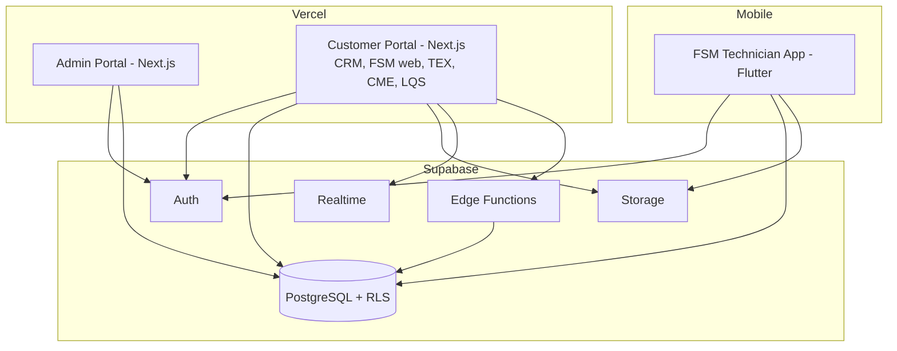

### 3. Platform and product boundary diagram

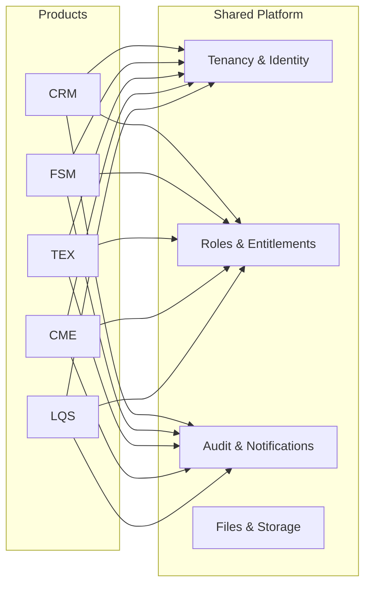

### 4. Multi-tenant architecture diagram

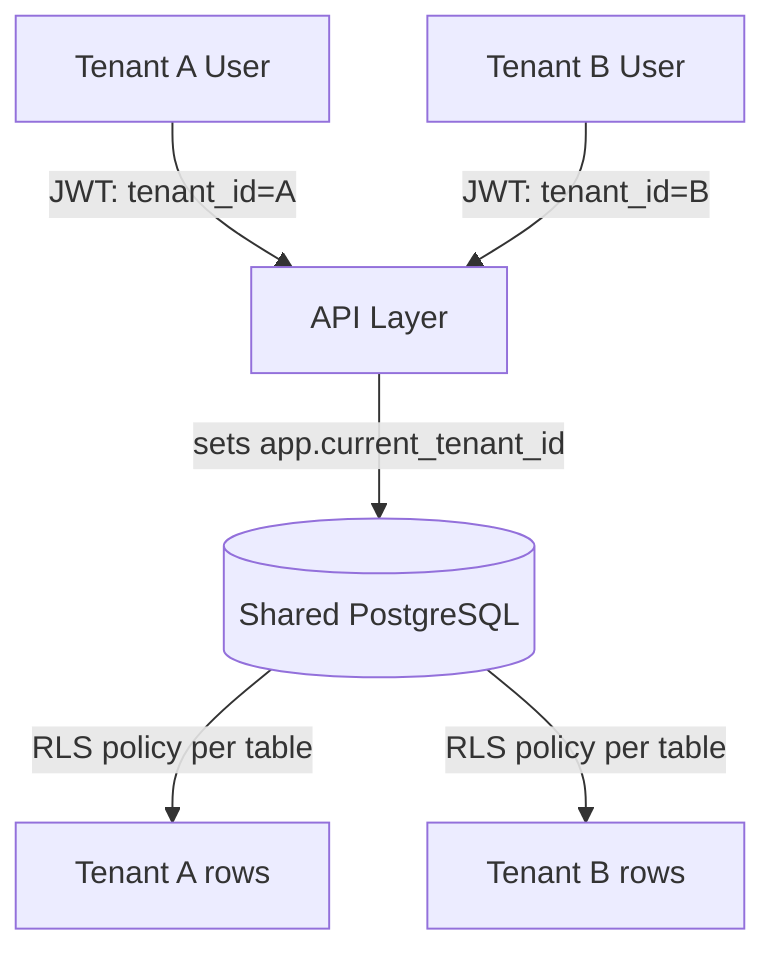

### 5. Authentication and authorization flow

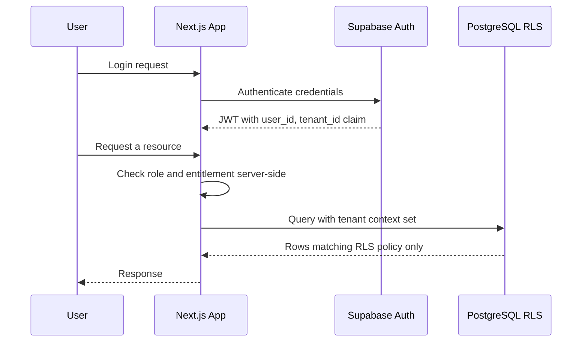

### 6. Tenant onboarding sequence

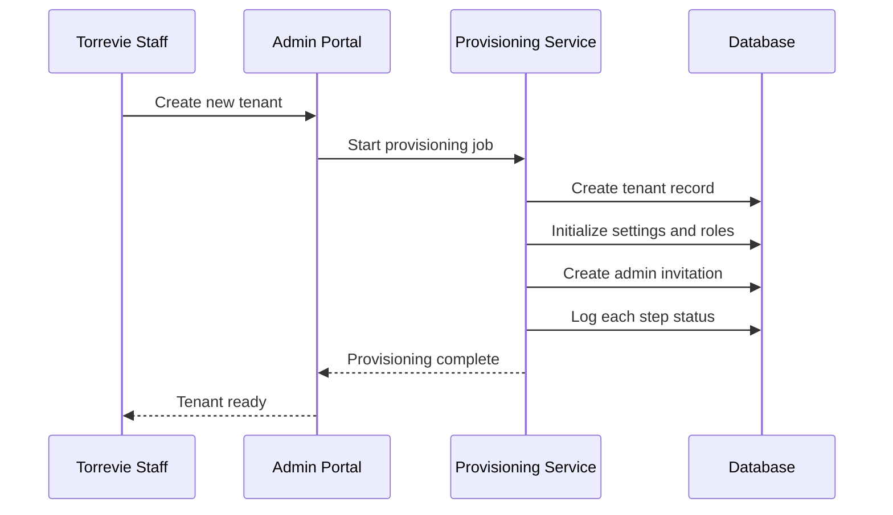

### 7. Product subscription activation sequence

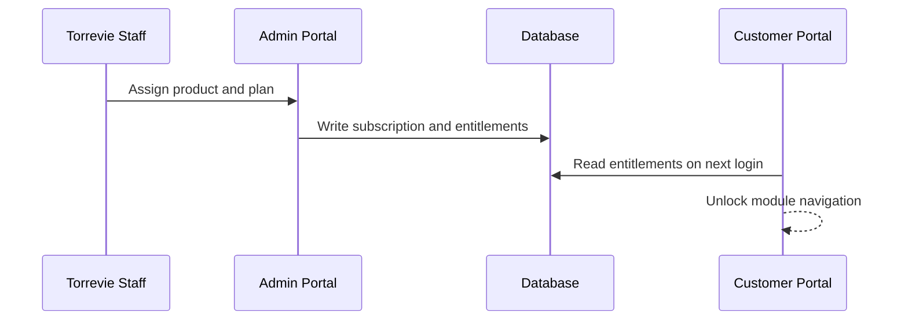

### 8. Request and tenant-context flow

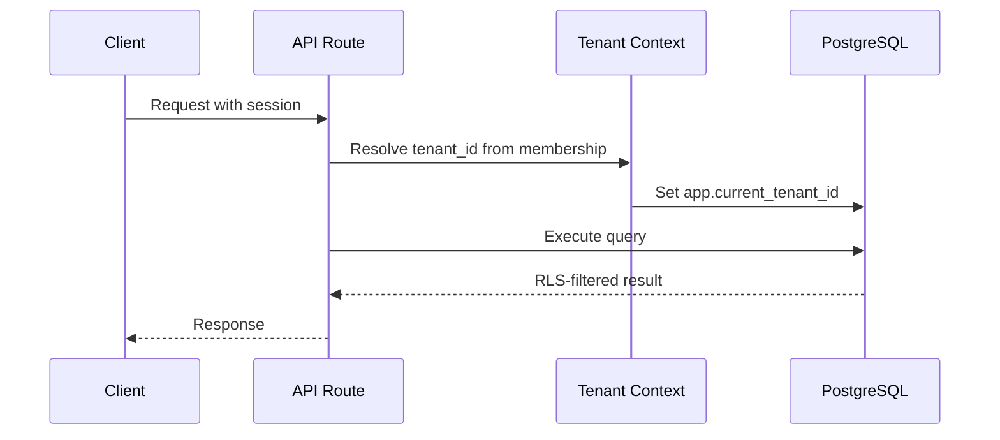

### 9. Deployment topology

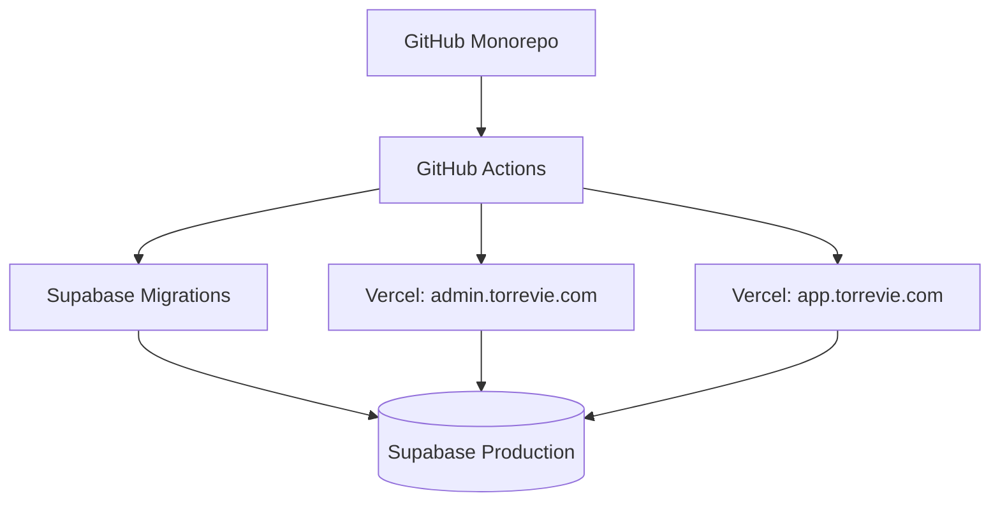

### 10. GitHub CI/CD flow

```mermaid
graph LR
    PR[Pull Request] --> Lint[Lint & Type Check]
    Lint --> UnitTests[Unit Tests]
    UnitTests --> IsoTests[Tenant Isolation Tests]
    IsoTests --> Review[Code Review]
    Review --> Merge[Merge to main]
    Merge --> StagingDeploy[Deploy to Staging]
    StagingDeploy --> E2E[End to End Tests]
    E2E --> ProdApproval[Manual Production Approval]
    ProdApproval --> ProdDeploy[Deploy to Production]
```

### 11. Integration and webhook flow

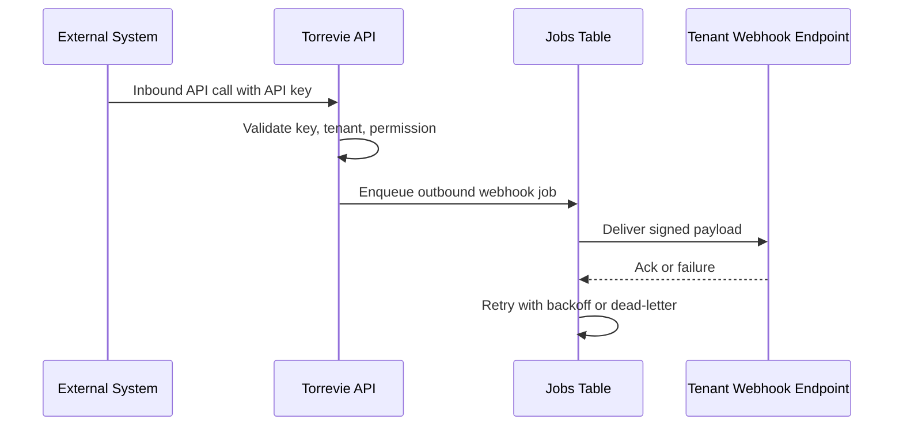

### 12. AI gateway flow

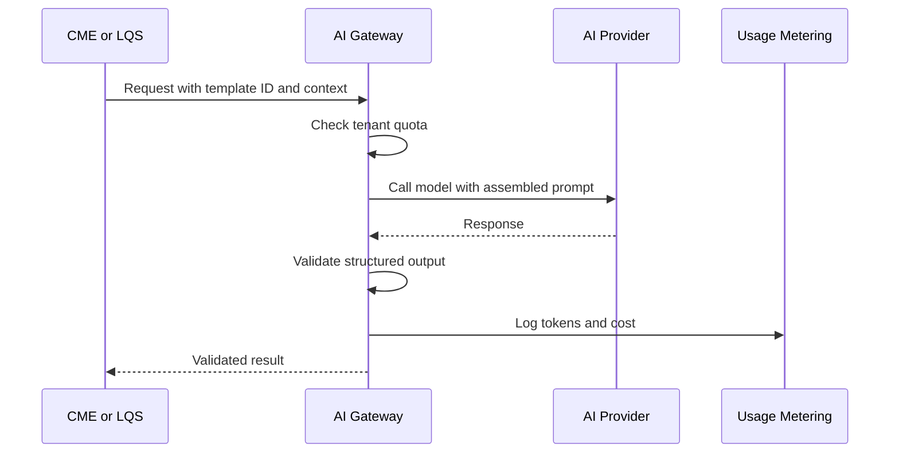

### 13. File-upload flow

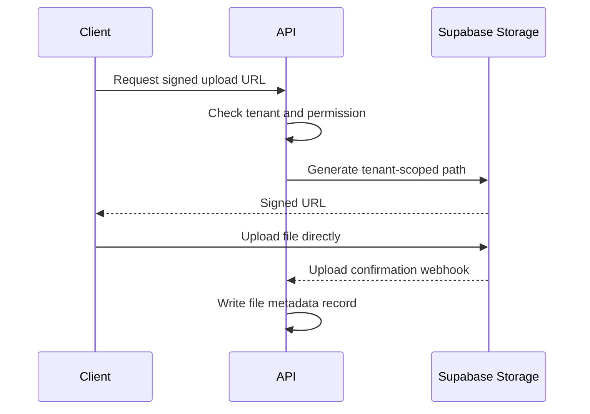

### 14. Notification flow

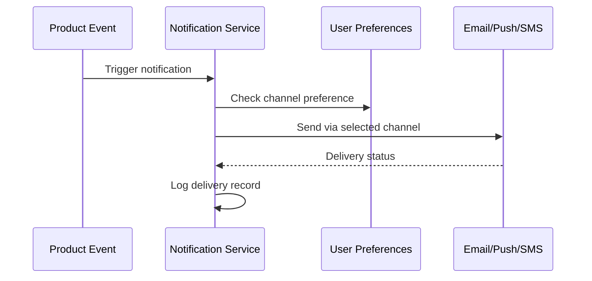

### 15. Background-job flow

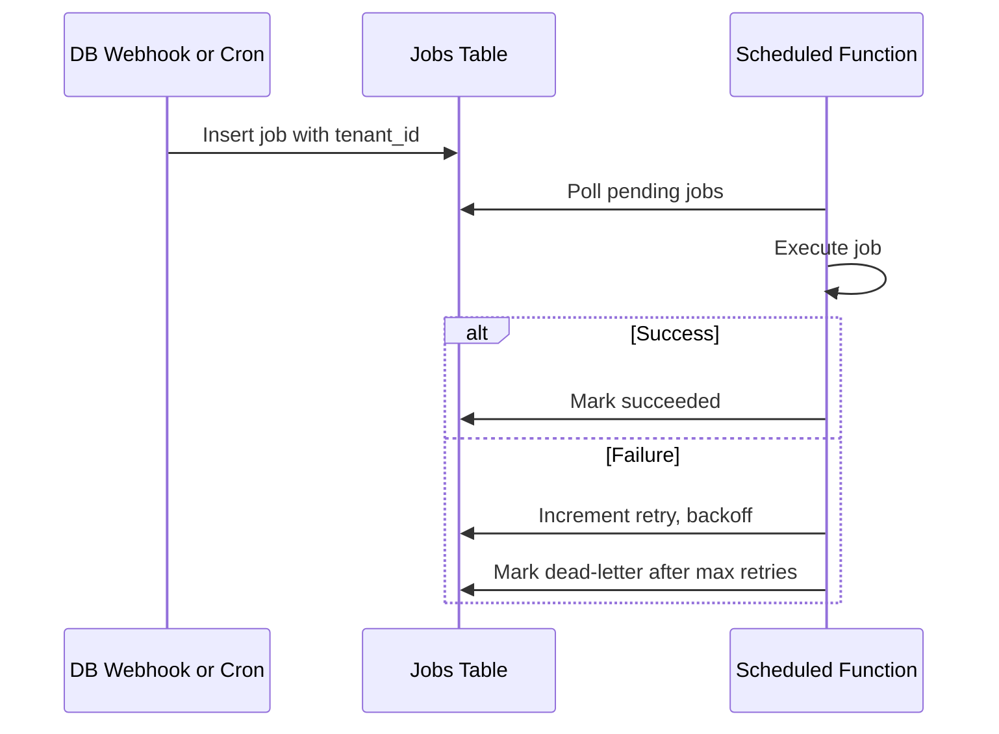

### 16. Customer offboarding flow

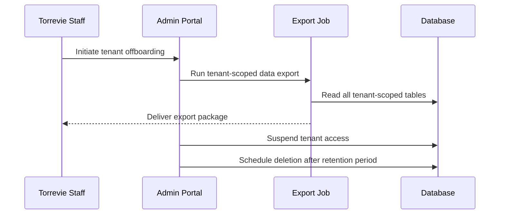

---

## 40. Risk Register

| Risk | Description | Probability | Impact | Severity | Mitigation | Owner category | Decision deadline |
| --- | --- | --- | --- | --- | --- | --- | --- |
| Multi-tenant data leakage | An RLS gap or missing tenant check exposes one tenant's data to another | Low | Critical | Critical | Tenant-isolation test suite as a release gate, mandatory RLS on every tenant table | Engineering | Before Phase 4 |
| Supabase scaling limits | Shared database performance degrades as tenant and data volume grow | Medium | High | High | Monitor connection pool and query performance from Stage 2 onward, defined upgrade triggers in Section 35 | Engineering | Ongoing, reviewed each stage |
| RLS complexity growth | Policy count and complexity become hard to reason about as tables grow | Medium | Medium | Medium | Consistent policy pattern per table, documented in the Database LLD, reviewed in every migration pull request | Engineering | Before Phase 3 |
| Flutter Web suitability | A future decision to reuse Flutter for web introduces the weaknesses this document rejected | Low | Medium | Low | This document's rejection is documented in ADR-003; any reconsideration requires a new ADR | Engineering | N/A, revisit only if requirements change materially |
| Vendor lock-in | Deep reliance on Supabase and Vercel makes a future migration costly | Medium | Medium | Medium | Keep business logic in the application layer, not in Supabase-specific stored procedures beyond what RLS requires | Engineering leadership | Reviewed at Stage 4 |
| Service-role misuse | A developer uses the service-role key informally to bypass RLS during debugging | Medium | Critical | High | Key restricted to a small number of server-only code paths, support-access mechanism as the sanctioned alternative | Engineering | Before Phase 3 |
| Preview-environment data access | A pull-request preview accidentally connects to production data | Low | Critical | High | Preview deployments always point at development or staging Supabase projects, enforced by environment-variable configuration, never production | Engineering | Before Phase 1 |
| Long-running workloads | AI or OCR processing exceeds Edge Function execution limits | Medium | Medium | Medium | Defined trigger in Section 24 to move to a dedicated queue system | Engineering | Reviewed at Phase 8 |
| AI cost overrun | Uncontrolled AI usage by one tenant drives unbudgeted cost | Medium | High | High | Hard per-tenant quotas, not just soft alerts, enforced before a call is made | Engineering, finance | Before Phase 8 |
| AI security | Prompt injection or cross-tenant leakage through AI features | Low | High | High | Strict instruction and content separation, tenant-scoped context only, as detailed in Section 23 | Engineering, security | Before Phase 8 |
| Workflow complexity | The lightweight workflow library is stretched beyond what it can cleanly express | Medium | Medium | Medium | Scope the library to the defined use cases at launch, revisit as a fuller engine only if concrete customer demand appears | Product, engineering | Reviewed at Phase 9 |
| Reporting performance | Cross-tenant or heavy reporting queries degrade transactional performance | Medium | Medium | Medium | Defined trigger for a read replica or warehouse in Section 26 | Engineering | Reviewed at Stage 3 |
| Existing application migration | crm1, fsm1, and tex1 carry more reusable value, or more hidden technical debt, than assumed | Medium | Medium | Medium | Confirm via actual code review before Phase 10 planning is finalized | Engineering leadership | Before Phase 10 |
| Custom-domain complexity | Customer-requested custom domains complicate SSL and routing | Low | Low | Low | Deferred as a future feature, not a launch requirement | Engineering | Reviewed when first requested |
| Data residency | A customer requires data to remain in a specific jurisdiction | Medium | Medium | Medium | Model 4 hybrid tenancy reserved as the answer, validated as a proof of concept before the first such contract | Engineering leadership, legal | Before that contract is signed |
| Customer-specific customization pressure | Individual customers request platform-level changes that fragment the shared codebase | Medium | Medium | Medium | Feature flags and tenant settings absorb most customization; genuine platform changes go through the ADR process | Product, engineering | Ongoing |
| Excessive shared-code coupling | Packages in the monorepo accumulate cross-product dependencies that make changes risky | Medium | Medium | Medium | Dependency rules and package-justification requirement in Section 31 | Engineering | Ongoing |
| Codex-generated inconsistency | Codex-produced code diverges from documented standards over many work packages | Medium | Medium | Medium | AGENTS.md as the standing reference, human review on every work package, Definition of Done checklist in Section 43 | Engineering | Ongoing |
| Insufficient automated tests | Test coverage lags behind feature delivery, especially for tenant isolation | Medium | High | High | Tenant-isolation and authorization tests treated as release-blocking, not optional | Engineering | Before Phase 4 and ongoing |

### Open questions

- Confirmed scope and data sensitivity of any real data currently in crm1, fsm1, or tex1 that would need migration rather than fresh seeding.
- Exact recovery-point and recovery-time objectives Torrevie is willing to commit to customers contractually.
- Whether any launch customer requires data residency outside Supabase's currently available regions.
- The specific AI providers Torrevie intends to contract with for CME and LQS, which affects the AI gateway's initial provider adapters.
- Whether SMS and WhatsApp Business are needed at launch or can follow shortly after, given their materially higher per-message cost than email.
- The specific commercial billing provider Torrevie will eventually integrate, which affects how the usage-metering data model maps to an external billing system.
- Whether any launch customer has an existing SSO requirement that would move enterprise SSO support earlier in the roadmap.

---

## 41. Implementation Roadmap

| Phase | Objective | Key dependencies | Exit criteria |
| --- | --- | --- | --- |
| Phase 0: Discovery and architecture validation | Confirm the assumptions in Section 5, review existing crm1, fsm1, tex1 code | This document | Assumptions confirmed or this document updated |
| Phase 1: Engineering foundation | Repository, tooling, CI skeleton, local Supabase | Phase 0 | A developer can clone, run locally, and open a passing pull request |
| Phase 2: Identity, tenancy, and security foundation | Platform schema, auth, tenant context, RLS, isolation tests | Phase 1 | Tenant-isolation suite passes in CI |
| Phase 3: Torrevie Control Plane | Tenant lifecycle, provisioning, subscription management | Phase 2 | Torrevie staff can create a tenant and assign a product end to end |
| Phase 4: Customer administration and unified portal | Customer portal shell, localization, right-to-left, customer admin | Phase 3 | A customer administrator can log in and manage their own users |
| Phase 5: CRM vertical slice | Accounts, contacts, opportunities, one pipeline view | Phase 4 | A CRM user can create and progress an opportunity end to end |
| Phase 6: FSM vertical slice and Flutter mobile foundation | Work orders, technician assignment, Flutter app foundation | Phase 4 | A technician can receive, update, and complete a work order from mobile |
| Phase 7: TEX vertical slice | Expense claims, approval workflow using the shared workflow library | Phase 4, workflow library | An expense claim can be submitted, approved, and marked reimbursed |
| Phase 8: LQS and AI gateway | Lead capture, scoring, AI gateway foundation | Phase 4 | A lead can be captured, scored, and routed, with AI usage tracked and quota-limited |
| Phase 9: CME and content workflows | Campaigns, content briefs, AI-assisted generation with human approval | Phase 8 | A piece of AI-assisted content can be drafted, approved, and marked published |
| Phase 10: Integration, reporting, and operational maturity | Integration framework maturity, reporting refinements, migration of existing applications | Phases 5 to 9 | At least one live third-party integration and one cross-tenant Torrevie analytics view are working |
| Phase 11: Enterprise hardening | Hybrid tenancy proof of concept, SSO, data residency options | Phase 10 | A defined enterprise contract's specific requirements are satisfied |

Calendar durations are intentionally not assigned; they depend on confirmed team capacity, which this document does not have visibility into.

---

## 42. LLD Preparation Checklist

| LLD document | Purpose | Key inputs | Required diagrams |
| --- | --- | --- | --- |
| Database LLD | Full column-level schema for every entity in Section 15 | This document's data architecture, product requirement detail per module | Entity relationship diagrams per domain |
| Tenant-isolation LLD | Exact mechanism for tenant-context propagation across every code path | Section 14 | Sequence diagrams per code path type |
| RLS policy specification | Every policy, per table, per operation | Database LLD | Policy-to-table matrix |
| Authentication LLD | Exact Supabase Auth configuration, MFA rollout, session settings | Section 16 | Auth flow diagrams |
| RBAC and permission matrix | Every role, every permission, mapped explicitly | Section 19 role hierarchy | Role-permission matrix |
| API specification | Every endpoint, request and response shape, versioning | Section 22, product requirements | API sequence diagrams |
| Web application LLD | Component structure, routing, state management for Next.js apps | Section 12, Section 18 | Component and routing diagrams |
| Flutter application LLD | Package choices, state management, offline-sync design | Section 18 | Layered architecture diagram |
| Torrevie Admin Portal LLD | Screen-by-screen detail for the Control Plane | Section 19 | Screen flow diagrams |
| Tenant-provisioning LLD | Exact provisioning-job steps and rollback handling | Section 19 | Provisioning sequence diagram, expanded from Section 39 |
| Workflow LLD | State machines for TEX approvals and CRM stage transitions | Section 21 | State-transition diagrams |
| Integration LLD | Connector-by-connector detail, starting with the first two or three planned | Section 22 | Integration sequence diagrams |
| Notification LLD | Template catalogue, channel routing rules | Section 25 | Notification flow, expanded from Section 39 |
| AI gateway LLD | Provider adapters, prompt-template structure, quota enforcement detail | Section 23 | AI gateway flow, expanded from Section 39 |
| Background-job LLD | Jobs-table schema, retry policy detail, upgrade-trigger monitoring | Section 24 | Job-state diagram |
| Storage LLD | Bucket structure, lifecycle rules, malware-scanning integration point | Section 17 | Storage path convention diagram |
| Audit and logging LLD | Event taxonomy, retention configuration | Section 15, Section 27 | Audit-event flow |
| CI/CD LLD | Full pipeline configuration, environment promotion rules | Section 31 | CI/CD flow, expanded from Section 39 |
| Environment and secret-management LLD | Every environment variable, its source, and its scope | Section 27, Section 30 | Environment topology diagram |
| Observability LLD | Tooling selection, dashboard definitions, alert thresholds | Section 29 | Observability data-flow diagram |
| Backup and disaster-recovery LLD | Tenant-scoped export mechanism, restore runbook | Section 34 | Recovery sequence diagram |
| Migration LLD | Concrete plan per existing application, based on the Phase 0 code review | Section 37 | Migration decision flow per application |
| Test strategy and test-case catalogue | Full enumerated test cases, especially tenant isolation | Section 26, Section 33 | Test coverage matrix |
| Threat model | Full STRIDE-style analysis per component | Section 27 | Data-flow diagram with trust boundaries |
| Operational runbooks | Incident response, on-call procedures, recovery steps | Section 29, Section 34 | Runbook flowcharts |

---

## 43. Codex Handoff Package

### A. Recommended repository tree

See Section 31.

### B. Root AGENTS.md outline

- Project overview and the one-line positioning: Torrevie is the operational intelligence company that fixes the workflow before applying AI.
- Architecture principles: modular monolith, shared tenancy with RLS, platform-versus-product boundaries, no cross-product direct table access.
- Coding standards: TypeScript strict mode, the shared validation library at every boundary, no raw SQL string concatenation.
- Testing standards: tenant-isolation and authorization tests are mandatory on any change touching a table, policy, or route.
- Security rules: no secrets committed, no service-role key outside the documented server-only paths, every tenant table requires RLS in the same pull request that creates it.
- Database migration rules: forward-only, reviewed, applied through CI, never by hand against production.
- UI design rules: reference to the Visual Identity and Brand Guidelines documents, Inter typography, the locked color palette, Arabic and right-to-left support required on every shared component.
- Definition of done: see below.
- Commands: setup, lint, test, build, migrate, listed exactly once the tooling is scaffolded in Phase 1.
- Environment-variable template: see below.
- Example seed data: synthetic tenants, users, and a small dataset per product, never real customer data.
- Module boundaries: the dependency rules from Section 31, stated explicitly.
- Prohibited practices: bypassing RLS, introducing a second UI framework, adding a new top-level dependency without justification in the pull request, logging secrets or full AI prompt bodies to operational logs.

### C. Development commands to standardize

`install`, `dev`, `lint`, `typecheck`, `test`, `test:isolation`, `build`, `supabase:start`, `supabase:migrate`, `supabase:seed`. Exact scripts are defined during Phase 1 and then referenced, not redefined, in every subsequent work package.

### D. Environment-variable categories

Supabase project URL and anonymous key, per environment; Supabase service-role key, server-only, per environment; AI provider API keys, per provider; email, SMS, and WhatsApp provider credentials; webhook signing secret; error-tracking and log-aggregation tokens. No real values are included in this document.

### E. Initial database migration sequence

1. `tenants`, `tenant_settings`
2. `users`, `tenant_memberships`, `user_profiles`
3. `roles`, `permissions`, `role_permissions`, `user_role_assignments`
4. `products`, `plans`, `plan_features`, `subscriptions`, `subscription_entitlements`
5. `audit_events`
6. `files`
7. `provisioning_jobs`, `provisioning_steps`
8. RLS policies for every table above, as a dedicated migration set
9. First product schema: CRM entities

### F. Initial seed-data strategy

Two or three synthetic tenants, each with a full set of roles represented, a small number of users per tenant, and enough CRM sample data to exercise the pipeline view. Seed data is regenerated, never hand-maintained as production drifts, and clearly excluded from any environment that could be mistaken for production.

### G. First 20 Codex work packages

1. **Repository scaffold.** Objective: initialize the monorepo structure from Section 31. Context: nothing exists yet. Allowed: root config, `package.json`, tooling config. Prohibited: any app or package logic. Requirements: lint and format run cleanly on an empty scaffold. Tests: a CI job that runs successfully on an empty commit. Acceptance: `pnpm install` and `pnpm lint` succeed. Docs: root README. Dependencies: none.
2. **Local Supabase setup.** Objective: Supabase CLI local stack running. Allowed: `supabase/` directory. Requirements: local stack starts and is reachable from a test script. Tests: a smoke test connecting to the local database. Acceptance: `supabase start` succeeds and is documented in AGENTS.md. Dependencies: package 1.
3. **Platform schema migration set 1.** Objective: tenants, users, memberships, profiles tables. Allowed: `supabase/migrations/`. Prohibited: application code. Requirements: migrations apply cleanly, forward-only. Tests: migration test confirming schema matches the Database LLD. Acceptance: local database reflects the schema. Dependencies: package 2.
4. **Roles and permissions schema.** Objective: roles, permissions, role_permissions, user_role_assignments tables and default seed roles. Allowed: `supabase/migrations/`, `supabase/seed/`. Requirements: default Torrevie and customer roles from Section 19 are seeded. Tests: seed applies cleanly. Dependencies: package 3.
5. **Subscription schema.** Objective: products, plans, plan_features, subscriptions, subscription_entitlements tables. Allowed: `supabase/migrations/`. Requirements: matches Section 15 entity list. Tests: migration test. Dependencies: package 3.
6. **RLS policy set for platform tables.** Objective: RLS policies for every table created so far. Allowed: `supabase/migrations/`. Requirements: one policy per operation per table, no combined catch-all policies. Tests: the first tenant-isolation test cases from Section 26, executed against these tables specifically. Acceptance: a Tenant A session cannot read a Tenant B row in any of these tables. Dependencies: packages 3 to 5.
7. **Auth integration.** Objective: Supabase Auth wired into a minimal Next.js app in `apps/customer-portal`. Allowed: `apps/customer-portal/`, `packages/auth/`. Requirements: login, session handling, tenant claim resolution as described in Section 14. Tests: an integration test logging in and confirming the tenant claim is present and correct. Dependencies: package 6.
8. **Tenant-context package.** Objective: the server-side tenant-resolution mechanism as its own shared package. Allowed: `packages/tenant-context/`. Requirements: every server-side data call goes through this package. Tests: unit tests for resolution logic, integration test confirming RLS session variable is set correctly. Dependencies: package 7.
9. **Permissions package.** Objective: role and permission-checking utilities as a shared package. Allowed: `packages/permissions/`. Requirements: server-side checks only, no client-side-only enforcement. Tests: unit tests covering every role in Section 19 against a representative permission set. Dependencies: package 8.
10. **Tenant-isolation test suite scaffold.** Objective: formalize the test cases from Section 26 as an automated, CI-gating suite. Allowed: `supabase/tests/`, a dedicated test package. Requirements: every case in Section 26 is represented. Tests: the suite itself, run in CI from this point forward on every relevant pull request. Dependencies: packages 6 to 9.
11. **Admin Portal shell.** Objective: `apps/admin-portal` scaffold with role-gated routing, no real features. Allowed: `apps/admin-portal/`. Requirements: only Torrevie staff roles can reach any route. Tests: an authorization test confirming a customer user cannot access the admin portal. Dependencies: package 9.
12. **Tenant lifecycle in the Admin Portal.** Objective: create, edit, suspend, reactivate, archive a tenant. Allowed: `apps/admin-portal/`, relevant server actions. Requirements: matches Section 19. Tests: end-to-end test creating and suspending a tenant. Dependencies: package 11.
13. **Provisioning pipeline.** Objective: the provisioning-job mechanism from Section 19 and Section 39, diagram 6. Allowed: `packages/tenant-context/` extensions, a new `packages/provisioning/`. Requirements: each step is independently retryable and its status is visible in the Admin Portal. Tests: a test simulating a failed step and confirming retry works without duplicating earlier steps. Dependencies: package 12.
14. **Subscription management in the Admin Portal.** Objective: assign products and plans to a tenant. Allowed: `apps/admin-portal/`. Requirements: writes to subscriptions and subscription_entitlements, matches Section 19. Tests: an end-to-end test assigning CRM to a tenant and confirming entitlement resolution. Dependencies: package 13.
15. **Customer Portal shell with localization.** Objective: `apps/customer-portal` shell, Arabic and English, right-to-left verified. Allowed: `apps/customer-portal/`, `packages/localization/`, `packages/ui/`. Requirements: every shared UI component renders correctly in both directions. Tests: a visual-regression test per shared component in both locales. Dependencies: package 9.
16. **Customer administration screens.** Objective: customer administrator can manage users and roles within their own tenant. Allowed: `apps/customer-portal/`. Requirements: fully scoped by RLS and permission checks, no path to another tenant's data. Tests: a tenant-isolation test specific to this feature. Dependencies: packages 10, 15.
17. **CRM schema and RLS.** Objective: accounts, contacts, opportunities, pipeline_stages tables with RLS. Allowed: `supabase/migrations/`. Requirements: matches Section 15's CRM entity summary. Tests: migration and RLS tests. Dependencies: package 6.
18. **CRM vertical slice UI.** Objective: account, contact, and a single pipeline view in `apps/customer-portal/crm`. Allowed: `apps/customer-portal/`, `packages/ui/`. Requirements: end-to-end usable by a seeded test tenant. Tests: an end-to-end test creating an opportunity and moving it through the pipeline. Dependencies: packages 16, 17.
19. **Audit logging integration.** Objective: wire `audit_events` writes into every mutation introduced so far. Allowed: cross-cutting change touching prior packages, reviewed carefully. Requirements: every create, update, delete, and permission-relevant action so far writes an audit event. Tests: a test confirming an audit event is written for a representative action in each area touched. Dependencies: packages 12 to 18.
20. **Observability foundation.** Objective: structured logging with correlation and tenant IDs, error tracking wired into both apps. Allowed: `packages/observability/`, application entry points. Requirements: every request log line carries a correlation ID and, where applicable, a tenant ID, with no secrets or sensitive record content logged. Tests: a test confirming a sample error is captured and correlated correctly. Dependencies: package 19.

### H. Definition of done

A work package is done when: it satisfies its stated acceptance criteria, it includes the tests specified, any table it touches has a corresponding RLS policy reviewed in the same pull request, it introduces no secret or credential into the repository, it follows the coding, testing, and security rules in AGENTS.md, it updates documentation where the change affects a documented behavior, and it has passed review from the assigned CODEOWNERS reviewer for any security-sensitive area it touches.

### I. Pull-request checklist

Lint and type-check pass. Unit and integration tests pass. Tenant-isolation suite passes if a tenant-scoped table, policy, or route was touched. No secret or credential appears in the diff. Migration files are forward-only and reviewed. Documentation is updated if behavior changed. The pull-request description states which work package this fulfills and confirms the acceptance criteria are met.

### J. Security checklist

Every new tenant-scoped table has RLS enabled with explicit policies for select, insert, update, and delete. No service-role key usage outside the documented server-only paths. No secret appears in logs, error reports, or client-side code. Every new API route enforces tenant, role, and entitlement checks server-side. Any new external integration stores its credentials encrypted and never logs them.

### K. Database migration checklist

Migration is forward-only and does not edit a previously merged migration file. Migration includes its RLS policies in the same pull request, not a follow-up. Migration is tested locally against the Supabase CLI stack before being submitted. Migration does not introduce a nullable `tenant_id` on a tenant-scoped table. Seed data, if included, is clearly synthetic.

### L. Tenant-isolation checklist

Every new table has RLS enabled before any application code queries it. Every new API route has an automated test proving a foreign tenant cannot access the resource. Every new Storage path follows the `tenant/{tenant_id}/...` convention with a corresponding Storage RLS policy. Every new background job or webhook handler receives an explicit tenant_id rather than inferring it ambiently.

### M. Release checklist

All work packages for the phase are individually done per the Definition of Done. The tenant-isolation suite passes in full against staging. End-to-end tests for the phase's critical paths pass against staging. A security checklist review has been completed for any new security-sensitive area. Documentation, including this HLD's roadmap status, is updated to reflect what shipped. Production promotion is a deliberate, reviewed action, never automatic.

---

## 44. Final Recommendation

1. **MVP architecture:** a modular monolith, one Next.js and TypeScript monorepo, deployed on Vercel, backed by a single shared Supabase PostgreSQL database with row-level security and mandatory tenant_id on every tenant-scoped table.
2. **Target architecture:** the same modular monolith through medium-scale growth, with specific domains, background processing first, then reporting, then possibly individual product domains, extracted into independently deployed services only when a stated, measured trigger in this document is actually met.
3. **Preferred web technology:** Next.js with TypeScript for every web surface, the Control Plane and the Customer Portal covering all five products.
4. **Preferred Flutter usage:** native mobile only, starting with the FSM technician application; Flutter Web is not used for any Torrevie web surface.
5. **Preferred Supabase tenancy model:** shared database, shared schema, mandatory tenant_id, strict row-level security, with dedicated-project hybrid tenancy reserved as a future path for a specific enterprise contract.
6. **Preferred Vercel deployment model:** two projects, admin.torrevie.com and app.torrevie.com, from the same monorepo, one Supabase project per environment.
7. **Preferred GitHub repository model:** a single monorepo with the structure in Section 31, enforced dependency rules, and CODEOWNERS on every security-sensitive path.
8. **Shared-platform versus product-module boundaries:** tenancy, identity, roles, entitlements, audit, storage, and notifications are owned once by the platform; each product owns its own domain-specific entities and workflows, sharing cross-cutting concepts, organizations, contacts, tasks, through the platform layer rather than duplicating them.
9. **First product vertical slice:** CRM, since its existing implementation is the most mature source of real requirements and its data model is the simplest against which to validate the platform foundation end to end.
10. **First security controls to complete:** row-level security tested against the full tenant-isolation suite, MFA enforced for all Torrevie staff, and secret management fully in place before any real customer data enters the system.
11. **First proof of concept to perform:** a working tenant-isolation test suite executed against the platform schema from work package 6, proving no cross-tenant access is possible, before any product-specific feature work begins.
12. **Documents to complete before Codex begins production development:** the Database LLD and the RLS policy specification, since every subsequent work package depends on a finalized schema and policy pattern; the Authentication LLD and RBAC matrix, since the tenant-context and permissions packages depend on them; and the root AGENTS.md itself, populated from Section 43.
13. **The exact first task assigned to Codex:** work package 1, the repository scaffold, followed strictly in the order given in Section 43 through work package 10, at which point the tenant-isolation suite is running in CI and gating every subsequent change. No product feature work begins before that gate is in place.

This is the primary recommendation. It is the most suitable path for Torrevie because it matches the size of the team building it, it does not defer the one problem that would be genuinely expensive to fix later, tenant isolation, and it leaves a documented, triggered path to every heavier piece of infrastructure, dedicated queues, read replicas, hybrid tenancy, microservices, so Torrevie adopts each one exactly when the evidence calls for it, not before.
